# 组件开发文档

## ‌**文档版本**‌

| 版本号 | 修改日期   | 修改人 | 修改内容 |
| ------ | ---------- | ------ | -------- |
| v1.0.0 | 2025-04-09 | 谭应谱 | 初版发布 |

[TOC]

## ‌**1. 概述**‌

### 1.1 组件简介

- 功能复用、统一接口调用
- 跨平台支持、多语言支持

### 1.2 技术依赖

1. ‌**IDE要求**‌
   - 需安装 ‌**Visual Studio 2022**‌，选择包含“.NET桌面开发”或“WPF开发工具”的工作负载
2. ‌**框架依赖**‌
   - 开发时需基于**.Net7**开发‌。
   - 通过NuGet包管理器添加第三方依赖库。

------

## ‌**2. 接口介绍**‌

### 2.1 接口列表

| 基类                        | 描述                     | 是否必需 |
| --------------------------- | ------------------------ | -------- |
| WpfCosmosAppWidget          | 组件基类，必须要继承该类 | ✅        |
| ICosmosDataInteraction      | 获取基础行情数据         |❌      |
| ICosmosAppAccessor          | 提供回调方法给引擎       | ❌       |
| ICosmosTradeDataInteraction | 获取交易类数据           | ❌       |

### 2.2 接口重点功能详解（具体使用参考示例）

- ‌**WpfCosmosAppWidget**：

  - 成员变量

    - ContextInjection：保存引擎的上下文问信息，主要包括皮肤资源、工作路径、日志记录等功能。

    - AccessProvider：提供请求回调给引擎，以便外部调用

      

  - 成员函数

    - StartAsync()：组件启动函数，可在该函数做一些初始化操作。

    - StopAsync()：组件关闭函数，可在该函数做一些释放资源等操作

    - PreClose()：组件预关闭函数，关闭之前通知组件先通知一下，如果组件当前状态不允许直接关闭、可返回false

    - PauseAsync()：组件暂停函数，暂未实现

    - ContinueAsync()：组件继续玉兴函数，暂未实现

      

- ‌**ICosmosDataInteraction**：

  - AccessorsInjection => DataAccessor => DataProvider：数据供应器，用于提供数据源

    - SearchFuzzyAsync()：根据关键字模糊搜索获取对应的股票列表

    - QueryIntradayQuoteAsync()：查询分时数据

    - QueryHistoricalQuoteAsync()：查询历史行情数据

    - QueryRealtimeQuoteAsync()：查询实时行情

    - QueryTradeHistoryAsync())：查询成交明细数据

    - SubscribeTrendQuoteAsync()：订阅分时行情

    - SubscribeRealtimeQuoteAsync()：订阅实时行情

    - SubscribeTradeHistoryAsync()：订阅成交明细数据

      

- **ICosmosAppAccessor**：

  - InvokeAsync():提供外部同步调用的方法

  - InvokeReturnAsync():暂不支持

  - NotifyAsync():提供外部异步通知的方法

  - SubscribeAsync():提供外部订阅调用的方法

  - UnsubscribeAsync():提供外部取消订阅调用的方法

    

- **ICosmosTradeDataInteraction**:暂未实现

### 2.3 接口文档

| 包名              | 接口文档                                              |
| ----------------- | ----------------------------------------------------- |
| Cosmos.App.Sdk    | [cosmos组件sdk](./接口文档/cosmos组件sdk.chm)         |
| Cosmos.DataAccess | [Cosmos行情数据sdk](./接口文档/Cosmos行情数据sdk.chm) |


------

## 3. 快速开始

### 3.1 创建项目

​      在vs2022上新建wpf类库工程

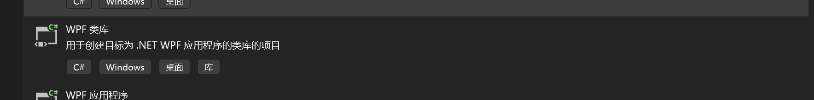

### 3.2 添加依赖包

**包列表**

| 包名                                   | 简单介绍                                                 | 是否必须 |
| -------------------------------------- | -------------------------------------------------------- | -------- |
| Cosmos.App.Sdk.0.0.43.nupkg            | 组件引擎基础包                                           | ✅        |
| Cosmos.OsslSignCode.Native.0.0.5.nupkg | 组件引擎基础包所依赖的包，用于权限校验                   | ✅        |
| Cosmos.App.Sdk.Windows.0.0.43.nupkg    | 开发进程间组件时需要引用，主要提供底外部窗口嵌入的底窗口 | ❌        |
| Cosmos.DataAccess.0.0.43.nupkg         | 基础数据行情数据源，获取基础行情数据需要应用             | ❌        |
| Cosmos.DataAccess.Trade.0.0.43.nupkg   | 对接第三方数据源，获取第三方数据源时，需要用到           | ❌        |

**获取路径**：[组件开发包](./组件开发包)

### 3.3 组件类实现

​	继承WpfCosmosAppWidget，实现基类方法（如下）

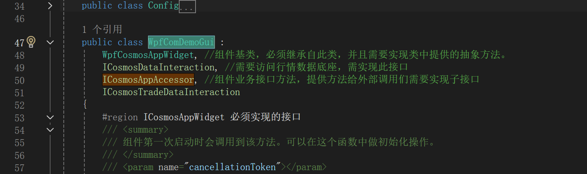

### 3.4 添加图标文件(PackageIcon.png)

​	nupkg打包需要

### 3.5 添加元数据文件（CosmosAppMetadata.xml）

​	用于配置组件信息，配置内容如下：

```c#
<?xml version="1.0" encoding="utf-8" ?>
<Cosmos>
  <!-- app元数据 -->
  <App>
    <Version>1.0.0.0</Version>
    <Base>
	  <!-- 包id，填入在管理端申请应用是返回的Appid -->
      <Guid>69cc84f4-56d3-4ece-a229-4df73af813a8</Guid>
      <Name>
        <zh-CN>Cosmos组件demoe</zh-CN>
        <en-US>Cosmos组件demoe</en-US>
      </Name>
      <Description>
        <zh-CN>Cosmos组件demoe</zh-CN>
        <en-US>Cosmos组件demoe</en-US>
      </Description>
    </Base>
    <!-- widget元数据集 -->
    <Widgets>
      <Widget>
        <Base>
		  <!-- 组件id，填入在管理端申请应用是添加组件返回的Widgetid -->
          <Guid>b0fd068e-2021-4619-acc0-53cda8d94a37</Guid>  
          <Name>
            <zh-CN>Cosmos组件demoe</zh-CN>
            <en-US>Cosmos组件demoe</en-US>
          </Name>
          <Description>
            <zh-CN>Cosmos组件demoe</zh-CN>
            <en-US>Cosmos组件demoe</en-US>
          </Description>
        </Base>
		<!-- 组件库路径 -->
        <LibraryFile>Cosmos.App.Hithink.ComDemo.dll</LibraryFile>
		<!-- 组件库入口类 -->
		<RuntimeType>Cosmos.App.Hithink.ComDemo.WpfComDemoGui</RuntimeType>
        <GuiFrameworks>wpf</GuiFrameworks>
      </Widget>
    </Widgets>
  </App>
</Cosmos>
```

#### 主要修改点：

- ：开发者前往应用开发平台申请应用后获取到，如下图

  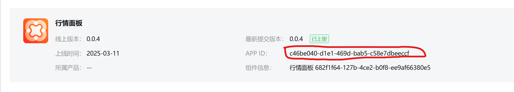组件的名称：上面例子中的"Cosmos组件demoe"和需要改成组件本身的名称

- 组件id：开发者在填写组件包详情时，填入组件信息生成的具体widgetid，如下图

  

- 组件库路径：填入当前组件项目生成的动态库路径

- 组件库入口类：填写实现WpfCosmosAppWidget类的完整类路径

### 3.6 调整工程属性，可参考示例（Cosmos.App.Hithink.ComDemo）

​	主要在项目文件中添加PackageTags和PackageId字段，该填写内容与填写元数据文件中的包id为同一个值

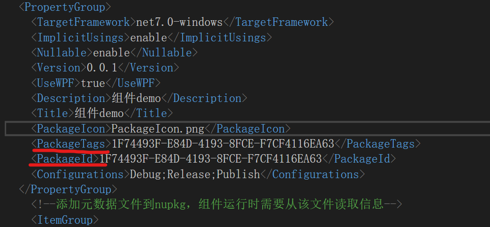 

### 3.7 打包

​	vs2022解决方案中选中对应项目右键选择pack，如下图

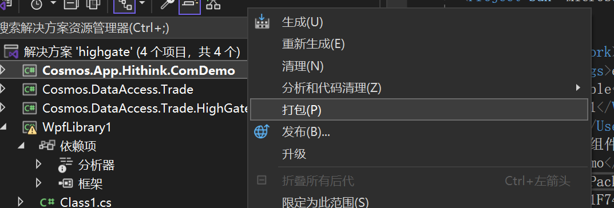 

------

## ‌**4. 示例** [参考示例](./Cosmos.App.Hithink.ComDemo/)

**组件示例中涉及到与宿主交互需要与宿主的示例搭配查看**

### 4.1 基础组件

下面方法实现最基本的组件，与引擎没有额外的通信，只实现了组件的基本功能

```c#
public class WpfComDemoGui : WpfCosmosAppWidget
{
	/// <summary>
    /// 组件第一次启动时会调用到该方法。可以在这个函数中做初始化操作。
    /// </summary>
    /// <param name="cancellationToken"></param>
    /// <returns></returns>
    public override async Task StartAsync(CancellationToken cancellationToken)
    {
        _logger?.Log(CosmosLogLevel.Information, "ComDemoGui 启动");
        return Task.CompletedTask;
    }


    /// <summary>
    /// 组件彻底关闭时会调用到该方法。可以在这个函数中做一些析构的操作。
    /// </summary>
    /// <param name="cancellationToken"></param>
    /// <returns></returns>
    public override Task StopAsync(CancellationToken cancellationToken)
    {
        _logger?.Log(CosmosLogLevel.Information, "ComDemoGui 退出");
        return Task.CompletedTask;
    }

    /// <summary>
    /// 该接口设计初衷是在组件最小化或者隐藏时调用，用于节省流量和cpu消耗，目前暂未实现
    /// 举例，行情买卖五档可在此函数中暂停订阅成交数据、停止发送UI交互事件
    /// </summary>
    /// <param name="cancellationToken"></param>
    /// <returns></returns>
    public override Task PauseAsync(CancellationToken cancellationToken)
    {
        _logger?.Log(CosmosLogLevel.Information, "ComDemoGui 暂停");
        return Task.CompletedTask;
    }
    /// <summary>
    /// 该接口设计初衷是在组件重新显示时调用，目前暂未实现
    /// 举例，行情买卖五档可在此函数中重新订阅成交数据
    /// </summary>
    /// <param name="cancellationToken"></param>
    /// <returns></returns>
    public override Task ContinueAsync(CancellationToken cancellationToken)
    {
        _logger?.Log(CosmosLogLevel.Information, "ComDemoGui 继续运行");
        return Task.CompletedTask;
    }
    
    /// <summary>
    /// 保存上下文信息
    /// </summary>
    private ICosmosAppContextInjection _ContextInjection;

    /// <summary>
    /// 该接口定义了当前组件和实例上下文的注入点，这些上下文在构造后由Cosmos引擎自动注入
    /// 可在该成员中实现对上下文的初始化和修改
    /// </summary>
    public override ICosmosAppContextInjection ContextInjection
    {
        get
        {
            return _ContextInjection;
        }
        set
        {
            _ContextInjection = value;
            OnContextInjection(value);

            ///创建组件访问器，并绑定到该组件上
            AccessProvider = new ComDemoProvider()
            {
                AppAccessor = this
            };
        }
    }

    public override ICosmosAppAccessProvider AccessProvider { get; set; }
}
```


#### 4.1.1 向宿主发送请求、订阅

```c#
public async Task TestSendHost()
{
    //向宿主发送请求
    {
        //获取当前组件实例id
        var cosmos = Convert.ToString(_ContextInjection.ThisInstanceContext.InstanceId);
        //向宿主获取userid信息、请求应答格式查看宿主demo应答格式
        var userid = await _ContextInjection.ThisAppContext.GlobalContexts.ProductContext.ProductAccessor.InvokeAsync(cosmos, "getUserID", "", 0);
        if (userid != null)
        {
            // 解析请求参数
            var response = JsonSerializer.Deserialize<GetUserIdResponse>(userid);
            if (response != null)
            {
                Console.WriteLine($"userid:{response.UserID}");
            }
        }
        //向宿主获取账户信息、请求应答格式查看宿主demo应答格式
        var accounts = await _ContextInjection.ThisAppContext.GlobalContexts.ProductContext.ProductAccessor.InvokeAsync(cosmos, "getAccounts", "", 0);
        if (userid != null)
        {
            // 解析请求参数
            var response = JsonSerializer.Deserialize<List<AccountInfo>>(accounts);
            if (response != null)
            {
                foreach (var account in response)
                {
                    Console.WriteLine($"AccountName:{account.AccountName}, Account:{account.Account}, Account:{account.Qsid}, Account:{account.State} ");
                }
            }
        }
    }

    //向宿主发起通知
    {
        //获取当前组件实例id
        var cosmos = Convert.ToString(_ContextInjection.ThisInstanceContext.InstanceId);
        var jsNotify = new JsonObject();
        jsNotify["name"] = "comDemo";
        string strNotify = JsonSerializer.Serialize(jsNotify);
        //向宿主发送设置名字消息、请求应答格式查看宿主demo应答格式
        _ContextInjection.ThisAppContext.GlobalContexts.ProductContext.ProductAccessor.NotifyAsync(cosmos, "SetName", strNotify, 0);
    }

    //向宿主发起订阅
    {
        //获取当前组件实例id
        var cosmos = Convert.ToString(_ContextInjection.ThisInstanceContext.InstanceId);
        //向宿主发送设置名字消息、请求应答格式查看宿主demo应答格式
        _ContextInjection.ThisAppContext.GlobalContexts.ProductContext.ProductAccessor.SubscribeAsync(cosmos, "SubUserID", "", (string subscriberId, string subscriptionId, string pushData)=>
        {
            //打印推送消息
            Console.WriteLine($"subscriberId:{subscriberId}, subscriptionId{subscriptionId},pushData{pushData}");

            //取消订阅
            _ContextInjection.ThisAppContext.GlobalContexts.ProductContext.ProductAccessor.UnsubscribeAsync(subscriberId, subscriptionId);
        });
    }
}
```

#### 4.1.2 处理外部调用请求、通知等

```c#
 /// <summary>
 /// 提供给宿主invoke调用的方法（同步方法）
 /// </summary>
 /// <param name="cosmosOperator">调用者</param>
 /// <param name="method">方法名</param>
 /// <param name="parameters">参数、json串，需要组件开发者自己定义好协议，提供给外部</param>
 /// <param name="timeoutSpan"></param>
 /// <returns></returns>
 /// <exception cref="NotImplementedException"></exception>
 public async Task<string> InvokeAsync(string cosmosOperator, string method, string parameters, int timeoutSpan = 0)
 {
     string strResult = string.Empty;
     switch (method.ToLower())
     {
         //获取text框文本
         case "gettext":
             strResult = _comDemo.GetText();
             break;
         default:
             throw new NotImplementedException();
     }

     return strResult;
 }

/// <summary>
/// cosmos引擎暂不支持，可暂不实现
/// </summary>
/// <param name="cosmosOperator"></param>
/// <param name="method"></param>
/// <param name="parameters"></param>
/// <param name="returnValueHandler"></param>
/// <param name="timeoutSpan"></param>
/// <returns></returns>
/// <exception cref="NotImplementedException"></exception>
 public Task InvokeReturnAsync(string cosmosOperator, string method, string parameters, Action<string> returnValueHandler, int timeoutSpan = 0)
 {
     throw new NotImplementedException();
 }

 internal class SetTextRequest
 {
     public string text { get; set; }
 }

 /// <summary>
 /// 提供给宿主notify调用的方法（异步方法）
 /// </summary>
 /// <param name="cosmosOperator">调用者</param>
 /// <param name="title">通知方法名</param>
 /// <param name="notification">通知内容</param>
 /// <param name="timeoutSpan"></param>
 /// <returns></returns>
 /// <exception cref="NotImplementedException"></exception>
 public Task NotifyAsync(string cosmosOperator, string title, string notification, int timeoutSpan = 0)
 {
     switch (title.ToLower())
     {
         //设置text框文本
         case "settext":
             var setTextRequest = JsonSerializer.Deserialize<SetTextRequest>(notification);
             _comDemo.SetText(setTextRequest?.text);
             break;
         default:
             throw new NotImplementedException();
     }
     
     return Task.CompletedTask;
 }

 /// <summary>
 /// 提供宿主订阅调用的方法（异步方法）
 /// </summary>
 /// <param name="cosmosOperator">订阅者</param>
 /// <param name="subscriptionTopic">订阅主题</param>
 /// <param name="parameters">订阅的参数</param>
 /// <param name="pushDataHandler">推送回调</param>
 /// <param name="timeoutSpan"></param>
 /// <returns>订阅成功id唯一标识，后续推送根据改id进行推送</returns>
 /// <exception cref="NotImplementedException"></exception>
 public async Task<string> SubscribeAsync(string cosmosOperator, string subscriptionTopic, string parameters, ISubscriberRaw<string, string, string, string, string, int>.PushDataHandler pushDataHandler, int timeoutSpan = 0)
 {
     string strUUid = string.Empty;
     switch (subscriptionTopic.ToLower())
     {
         //设置text框文本
         case "textchange":
             strUUid = _comDemo.SubscribeTextChange(cosmosOperator, pushDataHandler);
             break;
         default:
             throw new NotImplementedException();
     }

     return strUUid;
 }
 /// <summary>
 /// 取消订阅
 /// </summary>
 /// <param name="cosmosOperator">调用者</param>
 /// <param name="subscriptionId">订阅id</param>
 /// <param name="timeoutSpan"></param>
 /// <returns></returns>
 public Task UnsubscribeAsync(string cosmosOperator, string subscriptionId, int timeoutSpan = 0)
 {
     _comDemo.UnSubscribeTextChange(subscriptionId);
     return Task.CompletedTask;
 }
```


#### 4.1.2 响应主题切换通知事件

```c#
 private void OnContextInjection(ICosmosAppContextInjection injection)
 {
     /// 绑定主题变化事件, 当宿主通知需要切换主题时触发
     injection.ThisAppContext.GlobalContexts.VisualContext.ColorSchemeChanged += ColorSchemeChanged;
 }

 /// <summary>
 /// 主题变化事件,可在该函数中调整组件样式
 /// </summary>
 /// <param name="sender"></param>
 /// <param name="e"></param>
 private void ColorSchemeChanged(object? sender, string e)
 {
     //处理主题变化
 }
```

#### 4.1.3 获取当前主题的资源样式

```c#
private void btn_getthemedic_Click(object sender, RoutedEventArgs e)
{
    ///获取当前主题的资源字典
    var dictionary = _contextInjection.ThisAppContext.GlobalContexts.VisualContext.ThemeResources;
    var text = Newtonsoft.Json.JsonConvert.SerializeObject(dictionary);
    _logger?.Log(CosmosLogLevel.Information,$"ThemeResources:{text}");
    text_theme.Text = text;
}
```

#### 4.1.4 获取行情数据

```c#
 private async Task TestHqDataInerface()
 {
     ///根据输入文本模糊匹配股票数据
     {
         var fuzzySearchParameters = _dataAccessor.DataProvider.CreateFuzzySearchParameters();
         fuzzySearchParameters.Keyword = "0";
         var fuzzyResult = await _dataAccessor.DataProvider.SearchFuzzyAsync(fuzzySearchParameters);
         foreach(var assetInfo in fuzzyResult.MatchedAssetInfos)
         {
             Console.WriteLine($"代码：{assetInfo.AssetId.SymbolValue}, 市场：{assetInfo.AssetId.MarketId}");
         }
     }

     ///查询行情逐笔成交数据
     {
         var fieldIds = _dataAccessor.FieldIds;
         var tradeHistoryParameters = _dataAccessor.DataProvider.CreateTradeHistoryParameters();
         tradeHistoryParameters.RequestCount = 50;
         tradeHistoryParameters.AssetId = _dataAccessor.DataProvider.ToAssetId("USHA600000");
         tradeHistoryParameters.FieldIds = new[]
         {
             fieldIds.DateTime, fieldIds.Volclass, fieldIds.LastPrice, fieldIds.LatestTransactionVolume, fieldIds.TransactionCount
         };

         //获取需要查询字段的详细信息
         {
             foreach(var fieldId in tradeHistoryParameters.FieldIds)
             {
                 var filedInfo = _dataAccessor.DataProvider.QueryFieldInfo(fieldId);
                 Console.WriteLine($"字段中文名：{filedInfo.Name}," +
                     $"字段描述：{filedInfo.Description}");
             }
         }
         
         // 请求
         var queryResult = await _dataAccessor.DataProvider.QueryTradeHistoryAsync(tradeHistoryParameters);
         foreach(var item in queryResult.Data)
         {
             Console.WriteLine($"成交时间：{item.DateTime}," +
                 $" 成交价格：{item.LastPrice}," +
                 $"最新交易量：{item.LatestTransactionVolume}");
         }

         IDataSubscription tradeHistorySubscription = null;
         //订阅成交数据
         {
             tradeHistorySubscription = await _dataAccessor.DataProvider.SubscribeTradeHistoryAsync(tradeHistoryParameters, (object sender, ITradeHistoryResult pushResult) =>
             {
                 foreach (var item in pushResult.Data)
                 {
                     Console.WriteLine($"成交时间：{item.DateTime}, " +
                         $"成交价格：{item.LastPrice}," +
                         $"最新交易量：{item.LatestTransactionVolume}");
                 }
             });
         }

         //取消订阅成交数据
         if (tradeHistorySubscription is not null)
         {
             await tradeHistorySubscription.UnsubscribeAsync();
         }
     }

     ///查行情实时数据
     {
         var fieldIds = _dataAccessor.FieldIds;
         var realtimeQuoteParameters = _dataAccessor.DataProvider.CreateRealtimeQuoteParameters();
         var assetid = _dataAccessor.DataProvider.ToAssetId("USHA600000");
         realtimeQuoteParameters.AssetIds = new[] { assetid };
         realtimeQuoteParameters.FieldIds = new[]
         {
             fieldIds.AssetName,             //查股票名称
             fieldIds.LastPrice,             //查最新价
             fieldIds.PercentageChange,      //查涨跌幅  
             fieldIds.PreviousClosingPrice,  //查昨收价 
             fieldIds.StopBrand,             //是否停牌
         };
         realtimeQuoteParameters.TradingSessionType = TradingSessionType.Regular;

         // 查实时数据
         var quoteQueryResult = await _dataAccessor.DataProvider.QueryRealtimeQuoteAsync(realtimeQuoteParameters);
         var fieldValues = quoteQueryResult.ValuesAtAssetId(assetid);
         Console.WriteLine($"股票名称：{fieldValues[fieldIds.AssetName]}," +
             $"最新价：{fieldValues[fieldIds.LastPrice]}," +
             $"涨跌幅：{fieldValues[fieldIds.PercentageChange]}");


         //订阅唯一标识
         IDataSubscription subscription = null;
         // 订阅实时数据
         {
             subscription = await _dataAccessor.DataProvider.SubscribeRealtimeQuoteAsync(realtimeQuoteParameters, (object sender, IRealtimeQuoteResult quoteResult) =>
             {
                 if (quoteResult != null)
                 {
                     var fieldValue = quoteQueryResult.ValuesAtAssetId(assetid);
                     Console.WriteLine($"股票名称：{fieldValue[fieldIds.AssetName]}," +
                     $"最新价：{fieldValue[fieldIds.LastPrice]}," +
                     $"涨跌幅：{fieldValue[fieldIds.PercentageChange]}");
                 }
             });
         }

         //取消订阅实时数据
         {
             if (subscription is not null)
             {
                 await subscription.UnsubscribeAsync();
             }
         }
     }

     // 请求当日分时
     {
         var fieldIds = _dataAccessor.FieldIds;
         // 创建请求参数
         var trendQuoteParameters = _dataAccessor.DataProvider.CreateTrendQuoteParameters();
         trendQuoteParameters.AssetId = _dataAccessor.DataProvider.ToAssetId("USHA600000");
         trendQuoteParameters.FieldIds = new[]
         {
             fieldIds.DateTime,              //查成交时间
             fieldIds.OpenPrice,             //查开盘价
             fieldIds.ClosingPrice,          //查收盘价
             fieldIds.HighestPrice,          //查最高价
             fieldIds.LowestPrice,           //查最低价
             fieldIds.TransactionVolume,     //查成交量
             fieldIds.LastPrice,             //查最新价
             fieldIds.TransactionAmount,     //查成交金额
         }; ;
         trendQuoteParameters.TradingSessionType = TradingSessionType.Any;

         var trendQuoteResults = await _dataAccessor.DataProvider.QueryIntradayQuoteAsync(trendQuoteParameters);
         
         // 根据查询字段存贮到数组中
         var fullColumnFieldValues = trendQuoteResults.SelectMany(result => result.ColumnFieldValues)
                         .GroupBy(kv => kv.Key)
                         .ToDictionary(group => group.Key, group => group.SelectMany(pair => pair.Value).ToArray());

         for(int i = 0; i < fullColumnFieldValues[fieldIds.DateTime].Length; i++)
         {
             Console.WriteLine($"成交时间：{fullColumnFieldValues[fieldIds.DateTime][i]}, " +
                 $"开盘价：{fullColumnFieldValues[fieldIds.OpenPrice][i]}," +
                 $"收盘价：{fullColumnFieldValues[fieldIds.ClosingPrice][i]}" +
                 $"最高价：{fullColumnFieldValues[fieldIds.HighestPrice][i]}" +
                 $"最低价：{fullColumnFieldValues[fieldIds.LowestPrice][i]}" +
                 $"成交量：{fullColumnFieldValues[fieldIds.TransactionVolume][i]}" +
                 $"最新价：{fullColumnFieldValues[fieldIds.LastPrice][i]}" +
                 $"成交金额：{fullColumnFieldValues[fieldIds.TransactionAmount][i]}");
         }
     }

     // 请求历史分时
     {
         var fieldIds = _dataAccessor.FieldIds;
   
         // 创建请求参数
         var historicalQuoteParameters = _dataAccessor.DataProvider.CreateHistoricalQuoteParameters();
         historicalQuoteParameters.AssetId = _dataAccessor.DataProvider.ToAssetId("USHA600000");
         historicalQuoteParameters.PriceAdjustment = PriceAdjustment.ExRights;
         historicalQuoteParameters.FieldIds = new[]
         {
             fieldIds.DateTime,              //查成交时间
             fieldIds.LastPrice,             //最后成交价
             fieldIds.TransactionAmount,     //查成交金额
             fieldIds.TurnoverRate,          //换手率
             fieldIds.AfterHourVolume,       //盘后量
             fieldIds.PercentageChange,      //涨跌幅
         };

         var startIndex = 0;
         historicalQuoteParameters.PeriodId = _dataAccessor.PeriodIds.Day;
         historicalQuoteParameters.StartIndex = startIndex;
         historicalQuoteParameters.Count = 50;

         var historicalQueryResult = await _dataAccessor.DataProvider.QueryHistoricalQuoteAsync(historicalQuoteParameters);
         var fullResultFieldValues = historicalQueryResult.FieldValues;
         for (int i = 0; i < fullResultFieldValues[fieldIds.DateTime].Length; i++)
         {
             Console.WriteLine($"成交时间：{fullResultFieldValues[fieldIds.DateTime][i]}, " +
                 $"最后成交价：{fullResultFieldValues[fieldIds.OpenPrice][i]}," +
                 $"成交金额：{fullResultFieldValues[fieldIds.ClosingPrice][i]}" +
                 $"换手率：{fullResultFieldValues[fieldIds.HighestPrice][i]}" +
                 $"盘后量：{fullResultFieldValues[fieldIds.LowestPrice][i]}" +
                 $"涨跌幅：{fullResultFieldValues[fieldIds.TransactionVolume][i]}");
         }

     }


     // 查询最后一个交易日的所有交易时段
     var sortedFullRanges = await _dataAccessor.DataProvider.QueryLastDayTradingRange(_dataAccessor.DataProvider.ToAssetId("USHA600000"));
     foreach (var period in sortedFullRanges)
     {
         Console.WriteLine($"交易时间段 {period.Begin} - {period.End}");
     }

     //查询支持融资融券股票
     var rzrqBlock = await _dataAccessor.DataProvider.QueryRzrqBlock();
     foreach(var assetid in rzrqBlock)
     {
         Console.WriteLine($"支持融资融券 代码：{assetid.SymbolValue} 市场：{assetid.MarketId}");
     }

 }
```

#### 4.1.5 向第三方服务发送请求

参考文档：[第三方服务](./第三方服务请求.md)

#### 4.1.6 组件快捷键响应流程

```c#
// 获取全局快捷键
IReadOnlyDictionary<string, RegisteredShortcut> global = _contextInjection.ThisAppContext.GlobalContexts.
    EngineContext.BusinessRequest.ShortcutManager.GetGlobalShortcutAsync().Result;

//接受全局快捷键注册通知
_contextInjection.ThisAppContext.GlobalContexts.
    EngineContext.BusinessRequest.ShortcutManager.HotKeyRegist += (s, v) =>
    {
        foreach (var result in v)
        {
            if (result.IsSuccessful)
            {
                Console.WriteLine($"组件快捷键注册成功 id：{result.ShortcutId}  描述：{result.Description}  快捷键：{result.ShortCut}");
            }
            else
            {
                Console.WriteLine($"组件快捷键注册失败 reason：{result.ErrorMessage}");
            }
        }
    };

//接受全局快捷键取消注册通知
_contextInjection.ThisAppContext.GlobalContexts.
    EngineContext.BusinessRequest.ShortcutManager.HotKeyUnRegist += (s, v) =>
    {
        foreach (var result in v)
        {
            if (result.IsSuccessful)
            {
                Console.WriteLine($"快捷键取消注册成功 id：{result.ShortcutId}");
            }
        }
    };

// 内部快捷键响应处理
...

// 通知框架注册组件快捷键
var list = new List<ShortcutRegistrationRequest>();
list.Add(new ShortcutRegistrationRequest
{
    // 组件快捷键唯一标识
    ShortcutId = "1",
    ShortCut = new HotKey
    {
        // windows辅助键
        // MOD_ALT      0x0001
        // MOD_CONTROL  0x0002
        // MOD_NOREPEAT 0x4000
        // MOD_SHIFT    0x0004
        // MOD_WIN      0x0008
        Modifiers = 1,  

        // 虚拟按键映射 参照windows Virtual-key-codes
        Key = 66,
    }
});

var result = _contextInjection.ThisAppContext.GlobalContexts. EngineContext.BusinessRequest.ShortcutManager.RegisterComponentShortcutAsync(_contextInjection.ThisInstanceContext.WidgetGuid.ToString(), list);

```

**虚拟按键映射参考**：[虚拟按键映射表](https://learn.microsoft.com/zh-cn/windows/win32/inputdev/virtual-key-codes)


### 4.2 Cef组件示例

​    在基础组件的开发上，通过组件提供的创建cef示例的方法，创建一个cef窗口，并将cef窗口贴在组件上

```c#
public override async Task StartAsync(CancellationToken cancellationToken)
{
   
    _logger?.Log(CosmosLogLevel.Information,  "ComDemoGui 启动");

    //创建浏览器实例
    _webView = ContextInjection.ThisAppContext.GlobalContexts.EngineContext.WebViewFactory.CreateWebView();

    //绑定接收页面消息的事件
    _webView.WebMessageReceived += _webView_WebMessageReceived;
    var config = ReadFromResource("Config.json");

    // 获取url地址
    var url = System.IO.Path.Combine(System.IO.Path.GetDirectoryName(System.IO.Path.GetDirectoryName(System.IO.Path.GetDirectoryName(Assembly.GetExecutingAssembly().Location))), @"content\resources\index.html");

    //从资源中获取需要打开的页面地址、也可以直接写死一个地址
    _webView.Navigate(url);
 	
 	Content = _webView;
}
```

#### 4.2.1 JS向c#发送请求获取数据

##### 4.2.1.1 c#端实现

```c#
private async void _webView_WebMessageReceived(object? sender, WebViewWebMessageReceivedEventArgs args)
 {
     try
     {
         //解析请求参数
         ContextInjection.ThisAppContext.AppLogger?.Log(CosmosLogLevel.Information, $"WebMessageReceived args:{args?.WebMessageAsJson}");
         var message = JsonSerializer.Deserialize<List<object>>(args.WebMessageAsJson);
         var requestJson = message[0];

         if (string.IsNullOrEmpty(requestJson?.ToString()))
         {
             return;
         }
         //处理请求
         var result = await MessageProcessHandler(requestJson.ToString());
         //请求成功应答
         if (result.Item1 == 200)
         {
             await _webView.ExecuteScript(args._SussFunc, result.Item2);
         }
         //请求错误应答
         else
         {
             await _webView.ExecuteScript(args._FailFunc, result.Item1, result.Item2);
         }
     }
     catch (Exception ex)
     {
         ContextInjection.ThisAppContext.AppLogger?.Log(CosmosLogLevel.Error, $"WebMessageReceived Error:{ex}");
     }
 }

 private async Task<(int, string)> MessageProcessHandler(string requestJson)
 {
     ContextInjection.ThisAppContext.AppLogger?.Log(CosmosLogLevel.Information, $"MessageProcessHandler Request:{requestJson}");
     var errCode = 200;
     var msg = string.Empty;
     object result = string.Empty;
     try
     {
         // 解析请求参数
         var request = JsonSerializer.Deserialize<JsRequest>(requestJson);

         //请求类型为空，返回错误
         if (string.IsNullOrEmpty(request.Type))
         {
             return (500, "type is empty");
         }

         switch (request.Type.ToLower())
         {
             //处理cef返送的getthemeresources请求
             case "getthemeresources":
                 result = ContextInjection.ThisAppContext.GlobalContexts.VisualContext.ThemeResources;
                 break;
             default:
                 return (500, "type is not valid");
         }
         if (result != default)
         {
             msg = Newtonsoft.Json.JsonConvert.SerializeObject(result);
         }
     }
     catch (Exception ex)
     {
         errCode = 500;
         msg = $"Type:{ex.GetType()}; Message:{ex.Message}";
         ContextInjection.ThisAppContext.AppLogger?.Log(CosmosLogLevel.Error, $"MessageProcessHandler Error:{ex}");
     }

     ContextInjection.ThisAppContext.AppLogger?.Log(CosmosLogLevel.Information, $"MessageProcessHandler Record: {requestJson}; \n Response: {msg}");
     return (errCode, msg);
 }
```

##### 4.2.1.2 js段实现

```js
// 注册cefQuery函数，这一段可以直接固定引入
window.cefQuery = function (request, callback) {
    // 支持 Promise 和回调两种方式
    if (typeof callback !== 'function') {
        return new Promise((resolve, reject) => {
            cefQueryInternal.handleRequestAsync(request)
                .then(result => resolve(result))
                .catch(error => reject(error));
        });
    } else {
        cefQueryInternal.handleRequestAsync(request)
            .then(result => callback(null, result))
            .catch(error => callback(error, null));
    }
};

// 获取皮肤资源示例，将皮肤资源注入:root的css变量，根据需要使用，建议添加默认值
window.cefQuery({
    request: JSON.stringify({ Type: 'GetThemeResources' }),
    persistent: false,
    onSuccess: (data) => {
        console.log('client response', JSON.parse(data));
        const themeData = JSON.parse(data)
        let style = ``
        Object.entries(themeData.Color).forEach(([key, value]) => {
            // css的十六进制颜色表示的透明度位与其他UI框架存在差异
            style += `--${key}: #${value.slice(3, 9)}${value.slice(1, 3)};\n`
        })
        Object.entries(themeData.FontFamily).forEach(([key, value]) => {
            style += `--${key}: #${value};\n`
        })
        Object.entries(themeData.FontSize).forEach(([key, value]) => {
            style += `--${key}: #${value}px;\n`
        })
        const styleEl = document.createElement('style')
        styleEl.textContent = `:root { ${style} }`
        document.head.append(styleEl)
    },
    onFailure: (code, error) => {
        console.error(error)
    },
});

// 效果展示示例
window.cefQuery({
    request: JSON.stringify({ Type: 'GetThemeResources' }),
    persistent: false,
    onSuccess: (data) => {
        console.log('client response', JSON.parse(data));
        const themeData = JSON.parse(data)
        let domFragement = ``
        Object.entries(themeData.Color).forEach(([key, value]) => {
            domFragement += `<li style="--bg-color: #${value.slice(3, 9)}${value.slice(1, 3)}">${key}</li>`
        })
        Object.entries(themeData.FontFamily).forEach(([key, value]) => {
            domFragement += `<li style="--font-familay: ${value};">这是一段字体演示文字。${key}</li>`
        })
        Object.entries(themeData.FontSize).forEach(([key, value]) => {
            domFragement += `<li style="--fs: ${value}px;">这是一段字体大小演示文字。${key}</li>`
        })
        const ul = document.querySelector('ul')
        ul.innerHTML = domFragement;
    },
    onFailure: (code, error) => {
        console.error(error)
    },
});
```

#### 4.2.2 c#请求js方法

##### 4.2.2.1 c#端实现

```c#
private async void _webView_InitializationCompleted(object? sender, WebViewInitializationCompletedEventArgs e)
{
    //调用js的GetAdd方法
    var result = await _webView.ExecuteScriptAsync($"GetAdd(10,20)");
    Console.WriteLine($"Call JS Function Add, Result{result}");
}
```

##### 4.2.2.2 js端实现

```js
 window.GetAdd = function (x, y) {
     console.log(x + y);
     return x + y;
 }
```

### 4.3 进程间接入示例

参考文档：[Cosmos-RPC通信SDK使用说明](./进程间通信示例/Cosmos-RPC通信SDK使用说明.md)

##### 4.3.1设置崩溃文件路径和前缀名

```c#
//4、 设置崩溃文件路径和前缀名
dumpPath = System.IO.Path.Combine(System.IO.Path.GetDirectoryName(System.IO.Path.GetDirectoryName(Path.GetDirectoryName(Assembly.GetExecutingAssembly().Location))), @"dump");
dumpName = "TestWpf";
```


## ‌5. 本地测试

1. **将组件打包成nupkg包**

2. **放到cosmos目录下的.cosmos/.cpks路径下（路径不存在自己新建对应文件夹），如下图**

    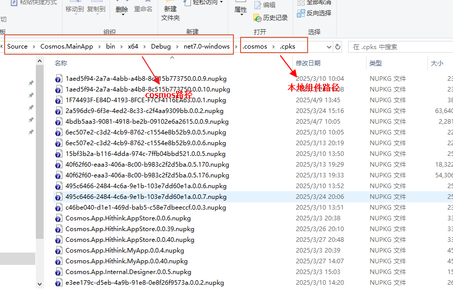 

3. **启动cosmos，组件来源切换到local**

   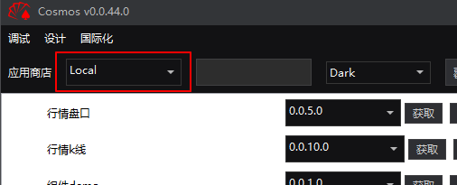 

4. **找到对应的组件、点击获取后再点击运行**

​    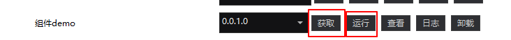


## ‌6. 常见问题

### Q1: 组件打包上传开发者失败

- 检查工程文件、元数据文件（CosmosAppMetadata.xml）、开发者端申请的appid是否一致

  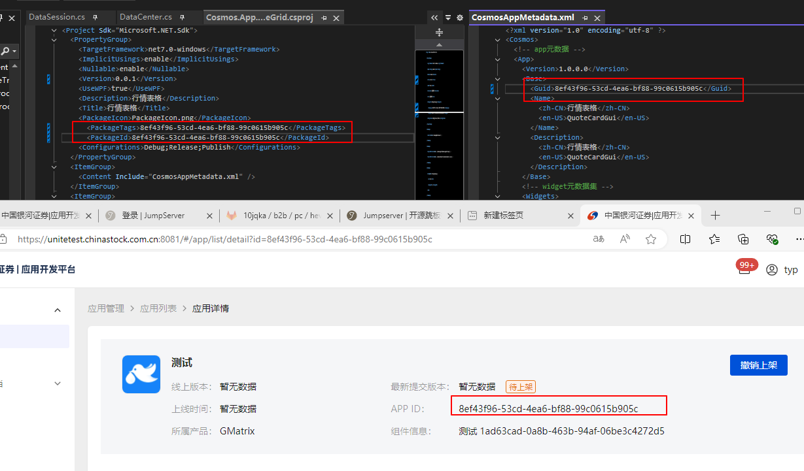 

- 检查元数据文件（CosmosAppMetadata.xml）、开发者端申请的widgetid是否一致

  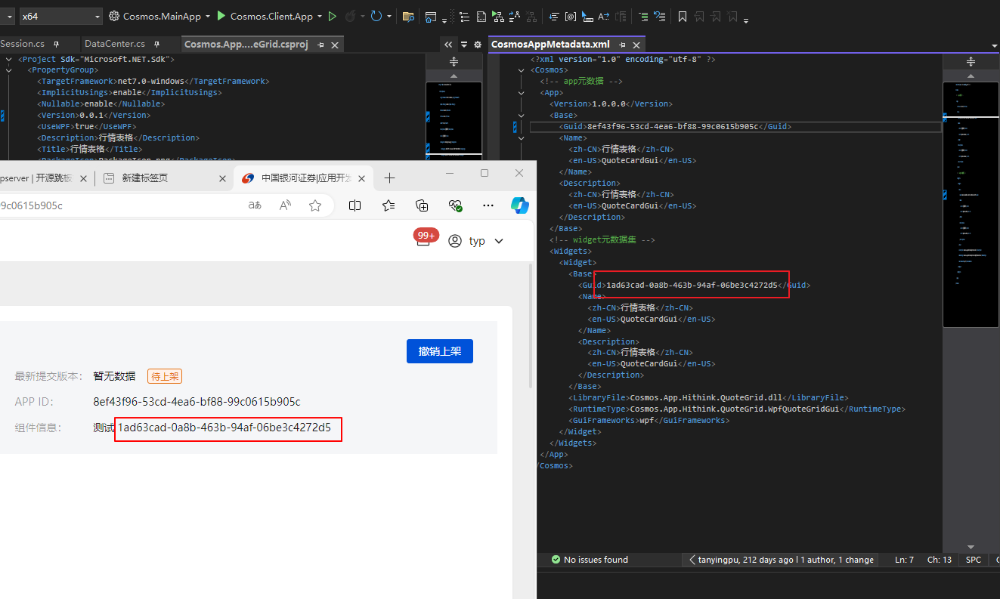 

### Q2: 应用市场无法打开应用

- 检查元数据文件（CosmosAppMetadata.xml）中appid、widgetid填写后是否有空格或者换行

  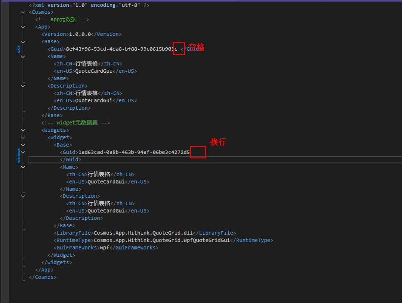 

- 检查元数据文件（CosmosAppMetadata.xml）中，dll的路径和类名是否和项目输出的dll和类名匹配

  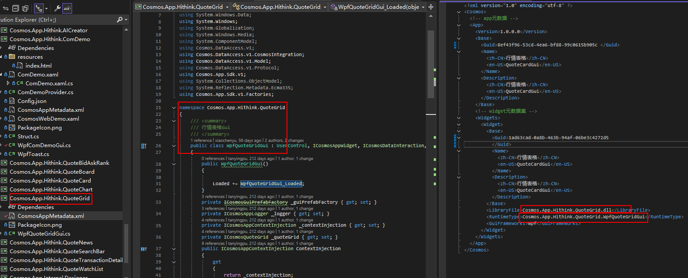 

  


------

## 7. 版本历史

| 版本号 | 发布日期   | 更新内容 |
| ------ | ---------- | -------- |
| v1.0.0 | 2025-04-09 | 初次发布 |