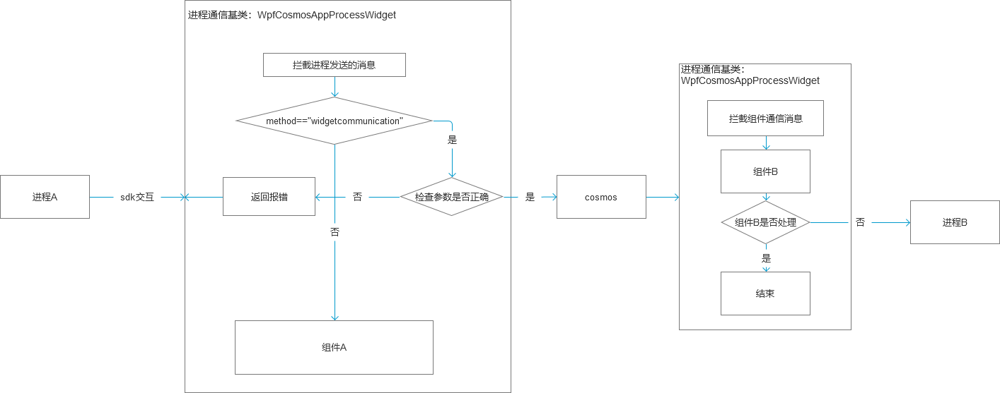

# Cosmos - RPC通信SDK使用说明

​        该文档主要介绍RPC实现及其使用案例。   

## SDK介绍

### 文件

​        PipeClient 项目

### 原理

​       技术架构：C++实现，导出C风格接口进行接入。以命名管道方式实现进程通信。SDK对外接口均进行异常捕捉保障稳定性。Windows平台下，所有能导入C库调用导出接口的架构终端均可接入（如主流 C/C++，C#，Python，Java，Rust，Go等，后续以C++，C#举例说明，其他在此不做介绍）

​       管道原理：该SDK以命名管道方式实现进程通信。SDK作为管道客户端，以服务端（Cosmos）给定的管道名称基于重叠I/O方式向服务端连接管道，以实现管道双向读写通信。

​       SDK原理：由C++代码实现，主要包括客户端管道类（PipeClient）和对外导出接口（注册回调接口、管道初始化接口、同步发送消息接口、通知消息接口、订阅接口、推送接口和内存释放接口）。业务层通过注册回调接口可向SDK注册响应消息及内存释放接口；通过管道初始化接口可启动管道客户端向服务端建立管道通信；通过导出的消息接口借用SDK向管道服务端发送对应消息处理业务。

​       业务协议（SDK接口调用协议）：

​       1）请求消息体

```C++
struct RpcRequest
{
	std::string id;			// 请求唯一id
	std::string method;		// 请求方法
	json        param;		// 请求参数（json对象） 
};
```
​       2）应答消息体

```C++
struct RpcResponse
{
	std::string id;			// 应答唯一id
	int         code = 0;    // code = 0 表示业务返回成功，code != 0 表示业务返回错误，业务按需定义错误编码
	json        error;		// 应答错误时返回业务报错内容
	json        result;		// 应答成功时返回业务数据
};
```

​       3）推送消息体

```C++
struct RpcPush
{
	std::string topic;		// 推送业务类型
	json        param;		// 推送数据
};
```

​       通信协议：

​       1）消息类型：INVK - 同步消息；NOTF - 通知消息；SUBS - 订阅消息；PUSH - 推送消息

​       2）消息格式：

​            协议格式："方法（4位）|data长度（8位）|预留符（12位）|uuid（36位，包含-）|数据"

​            示例："INVK|00000013|000000000000|d736df35-3d89-4cc8-8520-d6789cc49bd3|msgfromserver"

​      3）消息处理：

​            a. 先读取消息头（固定为64字节）：按协议格式解析出 方法，长度，预留符，uuid

​            b. 再读取消息体（按长度）：根据 方法 将消息体 分发给对应的注册回调的消息处理接口

​                INVK --> OnInvoke；NOTF --> OnNotify；SUBS --> OnSubscribe；PUSH --> OnPush （回调见后续注册回调接口说明）

​      4）数据类型：接口均以 char* 方式传入

​      5）数据量：单消息支持千万字节长度（理论最大长度：99999999字节，注：需考虑业务实际，如系统缓冲区足够）

​      6）时延：采用重叠I/O方式支持双向读写，目前延时受系统CPU资源调度、系统API因素影响，在ms级别。（注：读取数据后的处理受业务耗时影响）

### 导出接口

#### 1. 注册回调接口

```c
typedef void*(__cdecl*OnInvoke)(void* _in, int size);
typedef void(__cdecl* OnNotify)(void* _in, int size);
typedef void(__cdecl* OnSubscribe)(void* _in, int size);
typedef void(__cdecl* OnPush)(void* _in, int size);
typedef void(__cdecl* OnFreeVoidPtr)(void* _in);
typedef void(__cdecl  InvokeCallback)(RET_CALL, void*, int);

void Register(OnInvoke invoke, OnNotify notify, OnSubscribe subscribe, OnPush push, OnFreeVoidPtr FreeVoidPtr);
```

功能：业务层向SDK注册消息处理的回调函数

返回结果：无

参数说明：

​       OnInvoke -- 表示业务层响应SDK收到的 INVK 消息，即处理对方进程发送的 INVK 事件，该事件处理结果由SDK自动返回给发送方进行后续处理

​       OnNotify  -- 表示业务层响应SDK收到的 NOTF 消息，即处理对方进程发送的 NOTF 事件

​       OnSubscribe -- 表示业务层响应SDK收到的 SUBS 消息，即处理对方进程发送的 SUBS 事件

​       OnPush -- 表示业务层响应SDK收到的 PUSH 消息，即处理对方进程发送的 PUSH 事件

​       OnFreeVoidPtr -- 表示业务层释放分配的内存

​       InvokeCallback -- 表示业务层异步调用Invoke时向SDK注册的回调函数，以处理invoke返回数据（参数2）的业务逻辑

​       Register --  函数注册入口

#### 2. 管道初始化接口

```c
bool InitClient(const char* in_msg, int size, const char* log_path, int log_path_size, int protocol_level = 1, double del_log_cycle = 3.0, bool bdetaillog = false);
bool InitClientForC(const char* in_msg, int size, const char* log_path, int log_path_size, double del_log_cycle = 3.0, bool bdetaillog = false); // 为适配旧版TestWpf新增接口，该接口仅支持结构体协议，故仅能为C/C++使用
```

功能：业务层启动管道客户端并向服务端建立连接

返回结果：连接成功 --> 成功；初始化失败 --> 失败

参数说明：

​        in_msg -- 管道名称（由服务端生成），用于客户端连接

​        size      -- 管道名称长度

​        log_path -- SDK通信日志记录文件完整路径（含文件名）

​        log_path_size -- log_path长度

​        protocol_level -- 业务协议级别（1 -- 结构体协议（C++使用），2 -- 字符串协议（C#及其他使用））

​        del_log_cycle -- 保存日志周期（单位：天数，默认3天）

​        bdetaillog -- 是否记录详细日志标志（true：记录详细日志；false：记录简易日志）

#### 3. Invoke发送消息接口

```c
enum class RET_CALL{
    Exception = -3, //抛出异常
    Sendfail  = -2, //发送失败
    Timeout   = -1, //处理超时
    Pipenull  =  0, //管道实例销毁
    Ok        =  1  //处理成功
};

RET_CALL  Invoke(void* _in, void** _out, int* _out_size, int timeout = 30000);
void      InvokeAsync(void* _in, InvokeCallback callback, int timeout = 30000);
```

功能：业务层通过SDK向管道服务端发送同步(Invoke) 或 异步(InvokeAsync) INVK 消息，并得到服务端处理 INVK 消息后返回给业务层的结果

返回结果：见 RET_CALL 枚举说明

参数说明：

​        _in -- 业务层需要通过SDK发送给服务端的消息体（业务数据）

​        _out -- 服务端处理 INVK 消息后返回给业务层的结果（业务数据）

​        _out_size -- _out 长度（主要在 字符串协议 时使用，结构体协议时为0）

​        timeout -- 设定的超时时间（单位：毫秒，默认值：30000）

​        callback-- 回调函数（见 InvokeCallback，用以处理返回数据 ）


#### 4. 通知消息接口

~~~c
RET_CALL Notify(void* _in);
~~~

功能：业务层通过SDK向管道服务端发送 NOTF 通知消息，用于普通消息发送，且服务端业务层无返回业务数据场景

返回结果：见 RET_CALL 枚举说明

参数说明：

​        _in-- 业务层需要通过SDK发送给服务端的消息体（业务数据）

#### 5. 订阅消息接口

~~~c
RET_CALL Subscribe(void* _in);
~~~

功能：业务层通过SDK向管道服务端发送 SUBS 订阅消息，用于向服务端业务层订阅数据场景（注订阅管理及协议由业务双方实现，SDK仅做通信）

返回结果：见 RET_CALL 枚举说明

参数说明：

​        _in-- 业务层需要通过SDK发送给服务端的消息体（业务数据）

#### 6. 推送消息接口

~~~c
RET_CALL Push(void* _in);
~~~

功能：业务层通过SDK向管道服务端发送 PUSH 推送消息

返回结果：见 RET_CALL 枚举说明

参数说明：

​        _in-- 业务层需要通过SDK发送给服务端的消息体（业务数据）

#### 7. 内存释放接口

~~~c
void FreeRpcAllocMemory(void* _in);
~~~

功能：业务层释放SDK分配的内存

返回结果：无

参数说明：

​        _in-- 需要释放的内存指针

#### 8. 创建请求体接口

~~~c
void* CreateRpcRequest(const char* id, const char* method, const char* param);
~~~

功能：业务层调用SDK接口创建请求体（返回的void* 由SDK分配内存，业务层需要自己调用 FreeRpcAllocMemory 释放）

返回结果：请求体

参数说明：

​        id-- 请求id

​        method -- 请求方法

​        param -- 请求参数

#### 9. 创建推送提接口

~~~c
void* CreateRpcPush(const char* topic, const char* param);
~~~

功能：业务层调用SDK接口创建推送体（返回的void* 由SDK分配内存，业务层需要自己调用 FreeRpcAllocMemory 释放）

返回结果：推送体

参数说明：

​        topic -- 推送业务类型

​        param-- 推送数据

### 实现

​        SDK具体实现，见已提供的源码（RpcClint 中的 PipeClient 项目）

##                                                                                                                                                   SDK使用案例    

### 基础流程

​        1）服务端：服务端业务层启动服务端管道（自动启动客户端进程）

​        2）客户端：客户端进程被启动；解析命令参数获取管道名称（固定为第一个参数）；注册回调 Register；启动客户端管道 InitClient

​        3）双方收发消息

### 服务端（Cosmos）

​         以 Cosmos.App.Hithink.WpfProcessDemo 为例 （见：*/Cosmos.App.Hithink.WpfProcessDemo/WpfProcessDemoGui.cs 文件）

服务端注意点：

a. 适配屏幕缩放比

b. 设置标志防止服务端管道多开

c. 在业务组件第一次启动时启动管道，在业务组件退出关闭时释放组件

d. 启动管道时传入 父窗口句柄、窗口尺寸，以便客户端进程设置父子关系和适配尺寸位置

e. 窗口尺寸变化时，通知客户端进程尺寸变化消息以自动适应

部分代码介绍如下（注：主要介绍涉及到管道SDK通信相关）：

##### 1）声明管道变量

~~~c#
// 服务端进程通信器
public ICosmosRpcManager rpcManager { get; set; }
~~~

##### 2）构造初始化

~~~c#
public WpfProcessDemoGui()
{
    _wfh = new WpfCosmosHwndHost();
    _wfh.Margin = new Thickness(0, 0, 0, 0);
    // 设置大小改变事件
    _wfh.SizeChanged += _wfh_SizeChanged;
    SystemParameters.StaticPropertyChanged += SystemParameters_StaticPropertyChanged;

    // 设置窗口加载成功事件
    _wfh.Loaded += _wfh_Loaded;
    Content = _wfh;
}

WpfCosmosHwndHost _wfh { get; set; }
~~~

##### 3）启动/释放管道

~~~c#
// 窗口加载
private void _wfh_Loaded(object sender, RoutedEventArgs e)
{
    _logger?.Log(CosmosLogLevel.Information, "Wfh_Loaded");

    //窗口创建成功、可以启动进程通信服务
    StartRpcServer();
}

// 响应窗口尺寸变化
private void _wfh_SizeChanged(object sender, SizeChangedEventArgs e)
{
	ChangeProcessWindowSize();
}

// 响应屏幕缩放比例变化
private void SystemParameters_StaticPropertyChanged(object sender, PropertyChangedEventArgs e)
{
    var currentDpi = VisualTreeHelper.GetDpi(this);
    _logger.Log(CosmosLogLevel.Information, "SystemParameters_StaticPropertyChanged");
    if (currentDpi.DpiScaleX != _previousDpi.DpiScaleX)
    {
        _previousDpi = currentDpi;
        ChangeProcessWindowSize();
    }
}

// 通知客户端进程更改窗口尺寸
private void ChangeProcessWindowSize()
{
    try
    {
        //切换到主线程获取窗口大小
        Dispatcher.InvokeAsync(() =>
        {
            //窗口发生变化、通知进程需要调整窗口大小
            //组装调整大小命令、进程按照该组装方式进行解析           
            var graphics = VisualTreeHelper.GetDpi(this);
            ICosmosRpcRequest request = rpcManager?.CreateRpcRequest();
            request.id = Guid.NewGuid().ToString();	  // 设置请求id
            request.method = "setsize";				// 设置请求方法
            request.param = new JObject				// 设置请求参数
            {
                ["width"] = _wfh.ActualWidth,
                ["height"] = _wfh.ActualHeight,
                ["dpiRatio"] = _dpiRatioFirst,
                ["curscaling"] = graphics.DpiScaleX
            };

            g_mapRequest[request.id] = request;	   // 保存请求数据
            rpcManager?.NotifyAsync(request);	   // 向客户端进程发送Notify消息
        });
    }
    catch (Exception ex)
    {
        _logger?.Log(CosmosLogLevel.Error, $"调整窗口大小失败 {ex.Message}");
    }
}

// 组件彻底关闭时会调用到该方法
public override async Task StopAsync(CancellationToken cancellationToken)
{
    //组件关闭、释放进程通信资源
    ReleaseRpcMnager();
}

// 启动管道
Private int ProcessId;
public double _dpiRatioFirst = 1;
private DpiScale _previousDpi;
async void StartRpcServer()
{
    try
    {
        // 1.通过接口创建进程通信管理器
        rpcManager = _ContextInjection.ThisAppContext.GlobalContexts.EngineContext.BusinessRequest.CreateRpcManager();

        // 2、注册回调函数、响应对方进程的调用
        rpcManager.OnInvoke += HandleInvoke;
        rpcManager.OnPush += HandlePush;
        rpcManager.OnNotify += HandleNotify;
        rpcManager.OnSubscribe += HandleSubscribe;

        // 3.获取进程所在路径
        var clientDir = System.IO.Path.Combine(System.IO.Path.GetDirectoryName(System.IO.Path.GetDirectoryName(Path.GetDirectoryName(Assembly.GetExecutingAssembly().Location))), @"content\dependents\TestWpf.exe");

        // 4.手动获取当前WPF应用程序窗口句柄和真实窗口大小,组装命令行参数（用于客户端进程业务设置父子窗口和适配尺寸）
        var hwnd = _wfh.Handle;
        var hwndGraphics = Graphics.FromHwnd(hwnd);
        double dpiRatio = hwndGraphics.DpiX / 96;
        var actualWidth = _wfh.ActualWidth * dpiRatio;
        var actualHeight = _wfh.ActualHeight * dpiRatio;
        string strCmd = $"{hwnd}|{(int)actualWidth}|{(int)actualHeight}";

        // 5、启动进程通讯服务，并将当前父窗口的进程id和窗口大小通知对方进程、返回对方进程id（_logger，传入后服务端管道会记录通信日志信息）
        ProcessId = rpcManager.StartServerWithProcessId(clientDir, strCmd, _logger);
        if (ProcessId != 0)
        {
            //创建成功，向cosmos引擎设置进程信息
            ContextInjection.ThisAppContext.GlobalContexts.EngineContext.BusinessRequest.SetProcessInfo(ProcessId, this);
        }
    }
    catch (Exception ex)
    {
        _logger?.Log(CosmosLogLevel.Error, $"StartRpcServer:{ex.ToString()}");
    }

    _logger?.Log(CosmosLogLevel.Information, "StartRpcServer");
}

// 释放管道资源
private async void ReleaseRpcMnager()
{
    try
    {
        //组件关闭
        //1.向cosmos引擎取消注册的进程信息
        ContextInjection.ThisAppContext.GlobalContexts.EngineContext.BusinessRequest.RemoveProcessInfo(ProcessId);

        //2.发送关闭通知给进程
        string sizeinfo = $"close|";
        await rpcManager?.NotifyAsync(sizeinfo);

    }
    catch (Exception ex)
    {
        _logger?.Log(CosmosLogLevel.Error, $"ReleaseRpcMnager:{ex.ToString()}");
    }

    _logger?.Log(CosmosLogLevel.Information, "ReleaseRpcMnager");
}
~~~

##### 4）消息发送及响应

~~~c#
// 发送进程消息和处理进程消息
async Task<string> QryAccount_InvokeAsync()
{
    // 异步查询账户信息
    ICosmosRpcRequest async_param = rpcManager?.CreateRpcRequest();
    async_param.id = Guid.NewGuid().ToString();
    async_param.method = "qry_account";
    async_param.param = new JObject
    {
        ["ID"] = "123456",  //查询账户123456的信息
    };

    g_mapRequest[async_param.id] = async_param;
    ICosmosRpcResponse async_ret = await rpcManager?.InvokeAsync(async_param, 10000); //10秒超时
    {
        // 处理返回结果 async_ret
        if (g_mapRequest.ContainsKey(async_ret.id))
        {
            // 找到了请求上下文
            if (async_ret.code == 0) 
            {
                // 返回业务成功                    
                string async_method = g_mapRequest[async_ret.id].method;
                if (async_method == "qry_account")
                {
                    string ID = (string)async_ret.result["ID"];
                    if (g_mapActInfo.ContainsKey(ID))
                    {
                        g_mapActInfo[ID].Type = (int)async_ret.result["Type"];
                        g_mapActInfo[ID].Status = (int)async_ret.result["Status"];
                    }
                }
            }
            else
            {
                // 返回业务报错
                // 按报错处理
            }
        }                
    }

    return "OK";
}

private void HandlePush(ICosmosRpcPush data)
{
    // 处理SDK端发送Push消息
    string topic = data.topic;
    if (topic == "push_account")
    {
        // 处理推送账户信息
        string strID = (string)data.param["ID"];
        if (g_mapActInfo.ContainsKey(strID))
        {
            g_mapActInfo[strID].Type = (int)data.param["Type"];
            g_mapActInfo[strID].Status = (int)data.param["Status"];
        }
    }
}
private void HandleNotify(ICosmosRpcRequest data)
{
    // 处理SDK发送的Notify消息
    string method = data.method;
    if (method == "init_succ")
    {
        // 对方进程初始化完成，按需实现业务需求
        ChangeProcessWindowSize();
    }
    else if (method == "notf_sub")
    {
        // 对方初始化成功，可以向其发送通信，这里做如下业务操作
        // 1、订阅账户信息
        ICosmosRpcRequest sub = rpcManager?.CreateRpcRequest();
        sub.id = Guid.NewGuid().ToString();
        sub.method = "sub_account";
        sub.param = new JObject
        {
            ["ID"] = "123456" //订阅账户123456信息
        };

        g_mapRequest[sub.id] = sub;
        rpcManager?.SubscribeAsync(sub);


        // 2、查询账户信息（同步调用）
        ICosmosRpcRequest sync_param = rpcManager?.CreateRpcRequest();
        sync_param.id = Guid.NewGuid().ToString();
        sync_param.method = "qry_account";
        sync_param.param = new JObject
        {
            ["ID"] = "ALL" //查询所有账户信息
        };

        g_mapRequest[sync_param.id] = sync_param;
        ICosmosRpcResponse sync_ret = rpcManager.InvokeAsync(sync_param).Result; //默认30秒超时
        {
            // 处理返回结果 sync_ret
            if (g_mapRequest.ContainsKey(sync_ret.id))
            {
                // 找到了请求上下文
                if (sync_ret.code == 0)
                {
                    // 返回业务成功                    
                    string async_method = g_mapRequest[sync_ret.id].method;
                    if (async_method == "qry_account")
                    {
                        JToken resultToken = sync_ret.result;

                        // 反序列化 result 属性
                        var deserializedAccounts = JsonConvert.DeserializeObject<List<AccountInfo>>(resultToken.ToString());
                        foreach (var account in deserializedAccounts)
                        {
                            g_mapActInfo[account.ID] = account;
                        }
                    }
                }
                else
                {
                    // 返回业务报错
                    // 按报错处理
                }
            }                    
        }

        // 3、查询账户信息（异步调用）
        QryAccount_InvokeAsync();
    }
}

private ICosmosRpcResponse HandleInvoke(ICosmosRpcRequest data)
{
    // 处理SDK发送的Invoke消息
    ICosmosRpcResponse resp = rpcManager.CreateRpcResponse();
    if (data.method == "requestTheme")
    {
        resp.code = 0;
        var theme = _ContextInjection.ThisAppContext.GlobalContexts.VisualContext.ColorScheme;
        resp.result = new JObject();
        resp.result["theme"] = theme;
    }
    else if (data.method.Contains("requestThemeRes"))
    {
        resp.code = 0;
        var dictionary = _ContextInjection.ThisAppContext.GlobalContexts.VisualContext.ThemeResources;
        resp.result = JToken.FromObject(dictionary);
    }

    return resp;
}

private void HandleSubscribe(ICosmosRpcRequest data)
{
    // 处理SDK发送的Subscribe消息（类HandleNotify处理）
}
~~~

### 客户端（SDK）

​        分别以C#（TestWpf 项目）和C++（TestMfc 项目）举例说明。     

#### C#示例

​        文件：MainWindow.xaml.cs

​        流程：1）导入SDK的导出函数（见服务端导出接口7个），导入API接口（用于设置窗口关系、风格、位置等，后续介绍）

​                   2）解析命令行参数（第一个参数：管道名称；第二个参数：服务端窗口信息（见： $"{hwnd}|{(int)actualWidth}|{(int)actualHeight}" ）

​                   3）注册 Loaded 和 SourceInitialized 事件（SourceInitialized：设置父子关系，适配子窗口位置尺寸；Loaded ：注册管道回调函数，连接管道）

​                   4）收发业务通信处理

##### 1）进程入口

~~~c#
// 启动进程，解析参数，显示窗口（注：入口文件 App.xaml.cs；其他文件均为：MainWindow.xaml.cs）
namespace TestWpf
{
    public partial class App : Application
    {
        [DllImport("kernel32")]
        static extern bool AllocConsole();
        protected override void OnStartup(StartupEventArgs e)
        {
            base.OnStartup(e);

            // 解析命令行参数
            string[] args = e.Args;
            if (args.Length > 0)
            {
                MainWindow mainWindow = new MainWindow();
                if (args.Length > 1)
                {
                    // 设置管道名称，窗口信息
                    mainWindow._pipeName = args[0];
                    mainWindow._wndInfo = args[1];
                }
                mainWindow.Show();
            }
            else
            {
                // 没有命令行参数
                MainWindow mainWindow = new MainWindow();
                mainWindow.Show();
            }
        }
    }
}
~~~

##### 2）SDK接口封装

~~~c#
using System;
using System.Runtime.InteropServices;
using System.Runtime.Serialization;
using System.Text;
using System.Text.Json.Nodes;
using System.Threading;

//using System.Text.Encoding.CodePages;
using Newtonsoft.Json;
using Newtonsoft.Json.Linq;

namespace RpcWrapper
{
    public class CSharpRpcWrapper
    {
        // 定义 C++ 枚举类型
        public enum RET_CALL
        {
            Exception = -3,
            Sendfail = -2,
            Timeout = -1,
            Pipenull = 0,
            Ok = 1
        }

        /// <summary>
        /// 消息调用类型枚举，定义不同范围的消息发送方式。
        /// </summary>
        public enum InvokeType
        {
            /// <summary>
            /// 给具体实例发送消息，直接针对某个特定对象。
            /// </summary>
            Instance,

            /// <summary>
            /// 给某类的所有组件实例发送消息，作用于该类型的全部实例。
            /// </summary>
            Group,

            /// <summary>
            /// 给全局范围发送消息，所有监听该消息的对象都会收到。
            /// </summary>
            Global
        }

        public class RpcRequest
        {
            public string id = "";
            public string method;
            public JToken param;
        }

        public class RpcResponse
        {
            public string id = "";
            public int code = -1;
            public JToken error = JValue.CreateNull();
            public JToken result = JValue.CreateNull();
        }

        public class RpcPush
        {
            public string topic= "";
            public JToken param;
        }

        public delegate RpcResponse OnInvokeDelegate(RpcRequest param);
        public delegate void OnNotifyDelegate(RpcRequest param);
        public delegate void OnSubscribeDelegate(RpcRequest param);
        public delegate void OnPushDelegate(RpcPush param);
        public delegate void OnFreeVoidPtrDelegate(IntPtr param);

        public event OnInvokeDelegate OnInvoke;
        public event OnNotifyDelegate OnNotify;
        public event OnSubscribeDelegate OnSubscribe;
        public event OnPushDelegate OnPush;
        public event OnFreeVoidPtrDelegate OnFreeVoidPtr;

        // 定义 C++ 委托类型
        [UnmanagedFunctionPointer(CallingConvention.Cdecl)]
        public delegate IntPtr CPPOnInvokeDelegate(IntPtr param, int size);

        [UnmanagedFunctionPointer(CallingConvention.Cdecl)]
        public delegate void CPPOnNotifyDelegate(IntPtr param, int size);

        [UnmanagedFunctionPointer(CallingConvention.Cdecl)]
        public delegate void CPPOnSubscribeDelegate(IntPtr param, int size);

        [UnmanagedFunctionPointer(CallingConvention.Cdecl)]
        public delegate void CPPOnPushDelegate(IntPtr param, int size);

        [UnmanagedFunctionPointer(CallingConvention.Cdecl)]
        public delegate void CPPOnFreeVoidPtrDelegate(IntPtr param);

        // 定义回调函数
        private static CPPOnInvokeDelegate cpp_onInvoke;
        private static CPPOnNotifyDelegate cpp_onNotify;
        private static CPPOnSubscribeDelegate cpp_onSubscribe;
        private static CPPOnPushDelegate cpp_onPush;
        private static CPPOnFreeVoidPtrDelegate cpp_OnFreeVoidPtr;

        // 导入 C++ 函数
        [DllImport("PipeClient.dll", CallingConvention = CallingConvention.Cdecl)]
        public static extern bool InitClient(IntPtr pipename, int pipename_size, IntPtr logpath, int log_path_size, int protocolLevel, double del_log_cycle, bool bdetaillog);

        [DllImport("PipeClient.dll", CallingConvention = CallingConvention.Cdecl)]
        public static extern int Invoke(IntPtr _in, ref IntPtr _out, out int _outsize, int timeout = 30000);

        [DllImport("PipeClient.dll", CallingConvention = CallingConvention.Cdecl)]
        public static extern int Notify(IntPtr _in);

        [DllImport("PipeClient.dll", CallingConvention = CallingConvention.Cdecl)]
        public static extern int Subscribe(IntPtr _in);

        [DllImport("PipeClient.dll", CallingConvention = CallingConvention.Cdecl)]
        public static extern int Push(IntPtr _in);

        [DllImport("PipeClient.dll", CallingConvention = CallingConvention.Cdecl)]
        public static extern IntPtr CreateRpcRequest(string id, string method, IntPtr param);

        [DllImport("PipeClient.dll", CallingConvention = CallingConvention.Cdecl)]
        public static extern IntPtr CreateRpcPush(string topic, IntPtr param);

        [DllImport("PipeClient.dll", CallingConvention = CallingConvention.Cdecl)]
        public static extern void FreeRpcAllocMemory(IntPtr _in);

        [DllImport("PipeClient.dll", CallingConvention = CallingConvention.Cdecl)]
        public static extern void Register(CPPOnInvokeDelegate invoke, CPPOnNotifyDelegate notify, CPPOnSubscribeDelegate subscribe, CPPOnPushDelegate push, CPPOnFreeVoidPtrDelegate freevoidptr);

        [DllImport("PipeClient.dll", CallingConvention = CallingConvention.Cdecl)]
        public static extern void ExitApp();

        public CSharpRpcWrapper()
        {
            Encoding.RegisterProvider(CodePagesEncodingProvider.Instance);
        }

        public bool InitClient(string pipename, string logpath, double del_log_cycle = 3, bool bdetaillog = false)
        {
            IntPtr pipenamePtr = Marshal.StringToCoTaskMemAnsi(pipename);
            IntPtr logpathPtr = Marshal.StringToCoTaskMemAnsi(logpath);

            bool bRet = InitClient(pipenamePtr, pipename.Length, logpathPtr, logpath.Length, 2, del_log_cycle, bdetaillog);
            Marshal.FreeCoTaskMem(pipenamePtr);
            Marshal.FreeCoTaskMem(logpathPtr);
            return bRet;
        }

        public void RegisterCallback()
        {
            // 注册回调函数
            cpp_onInvoke = new CPPOnInvokeDelegate(On_Invoke);
            cpp_onNotify = new CPPOnNotifyDelegate(On_Notify);
            cpp_onPush = new CPPOnPushDelegate(On_Push);
            cpp_onSubscribe = new CPPOnSubscribeDelegate(On_Subscribe);
            cpp_OnFreeVoidPtr = new CPPOnFreeVoidPtrDelegate(On_FreeBusiparam);

            Register(cpp_onInvoke, cpp_onNotify, cpp_onSubscribe, cpp_onPush, cpp_OnFreeVoidPtr);
        }

        private IntPtr On_Invoke(IntPtr param, int size)
        {
            try{
                RpcRequest request = DeserializeRpcRequest(param, size);

                RpcResponse resp = OnInvoke?.Invoke(request) ?? default(RpcResponse);

                string msg = JsonConvert.SerializeObject(resp);
                IntPtr _out = Marshal.StringToHGlobalAnsi(msg);
                return _out;
            }
            catch (Exception ex) {

                return IntPtr.Zero;
            }            
        }        

        private void On_Notify(IntPtr param, int size)
        {
            RpcRequest request = DeserializeRpcRequest(param, size);            
            OnNotify?.Invoke(request);            
        }

        private void On_Subscribe(IntPtr param, int size)
        {
            RpcRequest request = DeserializeRpcRequest(param, size);
            OnSubscribe?.Invoke(request);
        }

        private void On_Push(IntPtr param, int size)
        {
            RpcPush push = DeserializeRpcPush(param, size);
            OnPush?.Invoke(push);            
        }

        private void On_FreeBusiparam(IntPtr param)
        {
            Marshal.FreeHGlobal(param);
        }

        public int Invoke(RpcRequest request, out RpcResponse response, int timeout = 30000)
        {
            IntPtr _in = CreatePpcPtrByRequest(request);

            IntPtr _out = IntPtr.Zero;
            int _outsize = 0;
            int ret = Invoke(_in, ref _out, out _outsize, timeout);
            FreeRpcAllocMemory(_in);

            response = DeserializeRpcResponse(_out, _outsize);
            FreeRpcAllocMemory(_out);
            return ret;
        }

        public async Task<(int ret, RpcResponse response)> InvokeAsync(RpcRequest request, int timeout = 30000)
        {
            RpcResponse response = new RpcResponse();
            int ret = await Task.Run(() => Invoke(request, out response, timeout));

            return (ret, response);
        }      

        public int Notify(RpcRequest request)
        {
            IntPtr _in = CreatePpcPtrByRequest(request);

            int ret = Notify(_in);
            FreeRpcAllocMemory(_in);
            return ret;
        }

        /// <summary>
        /// 向组件发送请求
        /// </summary>
        /// <param name="Instanceid">发送对象，根据type填入不同的参数</param>
        /// <param name="type">发送对象类型</param>
        /// <param name="parameter">发送内容</param>
        /// <param name="currentPage">是否只发送给当前页面</param>
        public async Task<(int ret, RpcResponse response)> InvokeWidget(string Instanceid, InvokeType type, RpcRequest parameter, bool currentPage = false)
        {
            var widgetPackage = PackWidget(Instanceid, type, parameter, currentPage);
            return await InvokeAsync(parameter);
        }

        /// <summary>
        /// 发送消息给组件
        /// </summary>
        /// <param name="Instanceid">发送对象，根据type填入不同的参数</param>
        /// <param name="type">发送对象类型</param>
        /// <param name="parameter">发送内容</param>
        /// <param name="currentPage">是否只发送给当前页面</param>
        public int NotifyWidget(string Instanceid, InvokeType type, RpcRequest parameter, bool currentPage = false)
        {
            var widgetPackage = PackWidget(Instanceid, type, parameter, currentPage);
            return Notify(widgetPackage);
        }

        private RpcRequest PackWidget(string Instanceid, InvokeType type, RpcRequest parameter, bool currentPage = false)
        {
            JObject widgetParam = new JObject();
            widgetParam["method"] = parameter.method;
            widgetParam["type"] = (int)type;
            widgetParam["currentPage"] = currentPage;
            widgetParam["instanceid"] = Instanceid;

            if (parameter.param is null)
            {
                parameter.param = new JObject();
            }
            parameter.param["Cosmos:WidgetComunication:Invoke"] = widgetParam;
            parameter.method = "Cosmos:WidgetComunication:Invoke";

            return parameter;
        }
        public int Subscribe(RpcRequest request)
        {
            IntPtr _in = CreatePpcPtrByRequest(request);
            int ret = Subscribe(_in);
            FreeRpcAllocMemory(_in);
            return ret;
        }

        private IntPtr CreatePpcPtrByRequest(RpcRequest request)
        {
            // 获取 GBK 编码
            Encoding gbkEncoding = Encoding.GetEncoding("GBK");

            // 转换为 GBK 编码的字节数组
            string input = request.param?.ToString() ?? "{}";
            byte[] gbkBytes = gbkEncoding.GetBytes(input);

            // 分配内存并复制字节数组
            IntPtr ptr = Marshal.AllocHGlobal(gbkBytes.Length);
            Marshal.Copy(gbkBytes, 0, ptr, gbkBytes.Length);

            IntPtr _out = CreateRpcRequest(request.id, request.method, ptr);

            // 释放内存
            Marshal.FreeHGlobal(ptr);

            return _out;
        }

        public int Push(RpcPush push)
        {
            // 获取 GBK 编码
            Encoding gbkEncoding = Encoding.GetEncoding("GBK");

            // 转换为 GBK 编码的字节数组
            string input = push.param?.ToString() ?? "{}";
            byte[] gbkBytes = gbkEncoding.GetBytes(input);

            // 分配内存并复制字节数组
            IntPtr ptr = Marshal.AllocHGlobal(gbkBytes.Length);
            Marshal.Copy(gbkBytes, 0, ptr, gbkBytes.Length);

            IntPtr _in = CreateRpcPush(push.topic, ptr);

            // 释放内存
            Marshal.FreeHGlobal(ptr);

            int ret = Push(_in);
            FreeRpcAllocMemory(_in);
            return ret;
        }

        public void Exit()
        {
            ExitApp();
        }

        private RpcRequest DeserializeRpcRequest(IntPtr param, int size)
        {
            RpcRequest request = new RpcRequest();
            if (param != IntPtr.Zero)
            {
                // 将 IntPtr 转换为字节数组
                byte[] gbkBytes = new byte[size];
                Marshal.Copy(param, gbkBytes, 0, size);

                // 将 GBK 字节数组解码为 UTF-8 字符串
                string gbkString = Encoding.GetEncoding("GBK").GetString(gbkBytes);
                string utf8String = Encoding.UTF8.GetString(Encoding.Convert(Encoding.GetEncoding("GBK"), Encoding.UTF8, gbkBytes));

                JObject jt = JObject.Parse(utf8String);
                if (jt.ContainsKey("id") && jt["id"] != null)
                {
                    request.id = (string)jt["id"];
                }

                if (jt.ContainsKey("method") && jt["method"] != null)
                {
                    request.method = (string)jt["method"];
                }

                if (jt.ContainsKey("param"))
                {
                    request.param = jt["param"];
                }
            }
            else
            {
                // 处理 param 为 null 的情况
            }            

            return request;
        }

        private RpcResponse DeserializeRpcResponse(IntPtr param, int size)
        {
            RpcResponse resp = new RpcResponse();
            if (param != IntPtr.Zero)
            {
                // 将 IntPtr 转换为字节数组
                byte[] gbkBytes = new byte[size];
                Marshal.Copy(param, gbkBytes, 0, size);

                // 将 GBK 字节数组解码为 UTF-8 字符串
                string gbkString = Encoding.GetEncoding("GBK").GetString(gbkBytes);
                string utf8String = Encoding.UTF8.GetString(Encoding.Convert(Encoding.GetEncoding("GBK"), Encoding.UTF8, gbkBytes));

                var jt = JObject.Parse(utf8String);
                if (jt.ContainsKey("id") && jt["id"] != null)
                {
                    resp.id = (string)jt["id"];
                }

                if (jt.ContainsKey("code") && jt["code"] != null)
                {
                    resp.code = (Int32)jt["code"];
                }

                if (jt.ContainsKey("error"))
                {
                    resp.error = jt["error"];
                }

                if (jt.ContainsKey("result"))
                {
                    resp.result = jt["result"];
                }
            }            

            return resp;
        }

        private RpcPush DeserializeRpcPush(IntPtr param, int size)
        {
            RpcPush push = new RpcPush();
            if (param != IntPtr.Zero)
            {
                // 将 IntPtr 转换为字节数组
                byte[] gbkBytes = new byte[size];
                Marshal.Copy(param, gbkBytes, 0, size);

                // 将 GBK 字节数组解码为 UTF-8 字符串
                string gbkString = Encoding.GetEncoding("GBK").GetString(gbkBytes);
                string utf8String = Encoding.UTF8.GetString(Encoding.Convert(Encoding.GetEncoding("GBK"), Encoding.UTF8, gbkBytes));

                JObject jt = JObject.Parse(utf8String);
                if (jt.ContainsKey("topic") && jt["topic"] != null)
                {
                    push.topic = (string)jt["topic"];
                }

                if (jt.ContainsKey("param"))
                {
                    push.param = jt["param"];
                }
            }            

            return push;
        }
    }
}

~~~

##### 3）构造初始化

~~~c#
private CSharpRpcWrapper wrapper = new CSharpRpcWrapper();	// SDK接口封装对象

// 窗口构造初始化
public MainWindow()
{
    InitializeComponent();
    this.Loaded += MainWindow_Loaded;
    this.SourceInitialized += MainWindow_SourceInitialized;
    
    // 注册SDK消息
    wrapper.OnInvoke += On_Invoke;
    wrapper.OnPush += On_Push;
    wrapper.OnNotify += On_Notify;
    wrapper.OnSubscribe += On_Subscribe;
}
~~~

##### 4）父子关系，尺寸适配

~~~c#
private void MainWindow_SourceInitialized(object sender, EventArgs e)
{
    this.SourceInitialized -= MainWindow_SourceInitialized;
    if(string.IsNullOrEmpty(_wndInfo))
    {
        return;
    }

    string[] parts = _wndInfo.Split('|');
    if (parts.Length > 2)
    {
        // 设置父子关系和窗口位置
        string msg = parts[0];
        string strwidth = parts[1];
        string strheight = parts[2];

        int parHandle = 0;
        int.TryParse(msg, out parHandle);
        curHwnd = new WindowInteropHelper(this).Handle;
        long lPreStyle = GetWindowLong(curHwnd, -16);
        long lPreExStyle = GetWindowLong(curHwnd, -20);

        lPreStyle &= ~WS_POPUP;
        lPreStyle |= WS_CHILD;
        lPreStyle &= ~(WS_BORDER | WS_THICKFRAME | WS_DLGFRAME);
        lPreExStyle &= ~(WS_EX_WINDOWEDGE | WS_EX_CLIENTEDGE);
        SetWindowLong(curHwnd, -16, lPreStyle);
        SetWindowLong(curHwnd, -20, lPreExStyle);
        SetParent(curHwnd, parHandle);
        WindowStyle = WindowStyle.None;
        ResizeMode = ResizeMode.NoResize;

        double width = 0;
        double.TryParse(strwidth, out width);
        double height = 0;
        double.TryParse(strheight, out height);
        MoveWindow(curHwnd, 0, 0, (int)width, (int)height, false);
        InvalidateRect(curHwnd, IntPtr.Zero, true);
        UpdateWindow(curHwnd);
    }
}

private double lastWidth = 0;
private double lastHeight = 0;
private double lastScaling = 1;

private async void UpdateWindow()
{
    await Task.Delay(300);

    Application.Current.Dispatcher.BeginInvoke(new Action(() =>
    {

        MoveWindow(curHwnd, 0, 0, (int)lastWidth, (int)lastHeight, false);
        InvalidateRect(curHwnd, IntPtr.Zero, true);
        UpdateWindow(curHwnd);

        InvalidateMeasure();
        InvalidateArrange();
        UpdateLayout();
    }));
}
~~~

##### 5）注册回调、连接管道

~~~c#
private void MainWindow_Loaded(object sender, RoutedEventArgs e)
{
    this.Loaded -= MainWindow_Loaded;

    // 注册回调函数
    RegisterCallBack();

    // 连接管道
    Connect();
}

// 注册回调函数（注：回调函数实现在6）消息发送及响应中介绍）
private void RegisterCallBack()
{
	wrapper.RegisterCallback();
}

// 连接管道
private void Connect()
{
    string log_path = "test_rpc_wpf.log";   // 管道日志文件
    if (string.IsNullOrEmpty(_pipeName))
        return;

    if (!InitClient(Marshal.StringToCoTaskMemAnsi(_pipeName), _pipeName.Length, Marshal.StringToCoTaskMemAnsi(log_path), log_path.Length))
    {
        MessageBox.Show("连接失败");
        return;
    }

    _pipeSucc = true;

    // 发送初始化消息
    RpcRequest request = new RpcRequest();
    request.id = Guid.NewGuid().ToString();
    request.method = "init_succ";
    wrapper?.Notify(request);
}
~~~

##### 6）消息发送及响应

~~~c#
// 消息发送（点击界面按钮）
private void Button_Click(object sender, RoutedEventArgs e)
{
    // 获取触发事件的按钮
    Button button = sender as Button;

    if (button != null)
    {
        switch (button.Name)
        {
            case "notify":
                {
                    if (_pipeSucc)
                    {
                        // 向 Cosmos 发送 Notify 消息
                        RpcRequest request = new RpcRequest();
                        request.id = Guid.NewGuid().ToString();
                        request.method = "notf_sub";
                        wrapper?.Notify(request);
                    }
                    else
                        MessageBox.Show("请先建立连接");
                    break;
                }
            case "push":
                {
                    if (_pipeSucc)
                    {
                        // 向 Cosmos 发送 Push 消息
                        string strSubkey = "sub_account_123456";
                        if (g_setSub.Contains(strSubkey))
                        {
                            // 说明订阅过该key，则可以推送数据
                            RpcPush push = new RpcPush();
                            push.topic = "push_account";
                            push.param = new JObject
                            {
                                ["ID"] = "123456",
                                ["Type"] = 1,
                                ["Status"] = 1
                            };
                            wrapper?.Push(push);
                        }
                    }
                    else
                        MessageBox.Show("请先建立连接");
                    break;
                }
            case "invokeAsync":
                {
                    if (_pipeSucc)
                    {
                        TestMethodInvokeAsync();
                        MessageBox.Show("异步测试后续流程 - 不阻塞");
                    }
                    else
                        MessageBox.Show("请先建立连接");
                    break;
                }
            case "invoke":
                {
                    if (_pipeSucc)
                    {
                        TestMethodInvoke();
                        MessageBox.Show("同步测试后续流程 - 被阻塞");
                    }
                    else
                        MessageBox.Show("请先建立连接");
                    break;
                }
            case "requestThemeRes":
                {
                    // 先获取到颜色资源字典
                    RquestThemeRes();
                    break;
                }
            case "requestTheme":
                {
                    // 获取到颜色资源字典后
                    // 获取主题 根据主题加载对应资源
                    RequestTheme();
                    break;
                }
            case "DemoButton":
                {
                    break;
                }
        }
    }
}

// 测试异步INVOKE方法
private async Task TestMethodInvokeAsync()
{
    RpcRequest request = new RpcRequest();
    request.id = Guid.NewGuid().ToString();
    request.method = "test_invoke_async";

    var (ret, response) = await wrapper.InvokeAsync(request);
    if (RET_CALL.Ok == (RET_CALL)ret)
    {
        MessageBox.Show("异步测试结果返回");
    }
}

// 测试同步INVOKE方法
private void TestMethodInvoke()
{
    RpcRequest request = new RpcRequest();
    request.id = Guid.NewGuid().ToString();
    request.method = "test_invoke";
    RpcResponse response = new RpcResponse();

    int interval = 30000;
    int ret = wrapper.Invoke(request, out response);
    if (RET_CALL.Ok == (RET_CALL)ret)
    {
        MessageBox.Show("同步测试结果返回");
    }
}

// 请求皮肤（向 Cosmos 发送 Invoke 请求）
private void RequestTheme()
{
    if (wrapper is not null)
    {
        RpcRequest request = new RpcRequest();
        request.method = "requestTheme";
        RpcResponse response = new RpcResponse();
        int ret = wrapper.Invoke(request, out response);
        if (ret == 1 && response.code == 0)
        {
            var converter = new BrushConverter();

            theme = response.result["theme"].ToString();
            Dictionary<string, object>? colorDic = _themeResources?[theme];

            ResourceDictionary resourseDict = new ResourceDictionary();
            foreach (KeyValuePair<string, object> kvp in colorDic)
            {
                resourseDict.Add(kvp.Key, converter.ConvertFrom(kvp.Value));
            }
            if (Application.Current.Resources.MergedDictionaries.Count == 0)
            {
                Application.Current.Resources.MergedDictionaries.Add(resourseDict);
            }
            else
            {
                Application.Current.Resources.MergedDictionaries[0] = resourseDict;
            }

            DemoButton.SetResourceReference(Button.BackgroundProperty, "color-background2");
            DemoButton.SetResourceReference(Button.ForegroundProperty, "color-font5");
        }
    }
}

// 请求主题资源（向 Cosmos 发送 Invoke 请求）
private void RquestThemeRes()
{
    if(wrapper is not null)
    {
        RpcRequest request = new RpcRequest();
        request.method = "requestThemeRes";
        RpcResponse response = new RpcResponse();
        int ret = wrapper.Invoke(request, out response);
        if (ret == 1 && response.code == 0)
        {
            string outputMessage = response.result.ToString();
            _themeResources = Newtonsoft.Json.JsonConvert.DeserializeObject<Dictionary<string, Dictionary<string, object>>>(outputMessage);
        }
    }
}

// 消息响应
private RpcResponse On_Invoke(RpcRequest request)
{
    RpcResponse resp = new RpcResponse();
    resp.id = request.id;
    resp.code = 0;  //默认设置成功

    string strMethod = (string)request.method;
    if (strMethod == "qry_account")
    {
        // 查询账户
        string id = (string)request.param["ID"];
        if (id == "ALL")
        {
            // 查询所有账户信息
            List<AccountInfo> accounts = new List<AccountInfo>
                {
                    new AccountInfo { ID = "123456", Type = 1, Status = 1 },
                    new AccountInfo { ID = "456789", Type = 2, Status = 0 }
                };

            resp.result = JToken.FromObject(accounts);
        }
        else if (id == "123456")
        {
            // 查询指定账户ID的账户信息（假设 ID 为 "123456"，即返回账户123456的信息）
            resp.result = new JObject
            {
                ["ID"] = "123456",
                ["Type"] = 1,
                ["Status"] = 1,
            };
        }
        else
        {
            resp.code = -1;
            resp.error = new JObject
            {
                ["msg"] = "未找到查询的账户ID",
            };
        }
    }
    else
    {
        // 其他查询业务
    }

    return resp;
}

private async void On_Notify(RpcRequest request)
{
    if (request.method == "setsize")
    {
        // 调整尺寸位置
        double scaling = (double)request.param["curscaling"];
        double dpiratio = (double)request.param["dpiRatio"];
        double width = (double)request.param["width"] * dpiratio;
        double height = (double)request.param["height"] * dpiratio;

        if (lastWidth == width && lastHeight == height && lastScaling == scaling)
        {
            return;
        }
        else
        {
            lastWidth = width;
            lastHeight = height;
            lastScaling = scaling;

            UpdateWindow();
        }
    }
    else if (request.method == "close")
    {
        // 关闭
        Application.Current.Dispatcher.BeginInvoke(new Action(() =>
        {
            this.Close();
        }));
    }
    else if(request.method == "SchemeChanged")
    {
        // 主题切换
        Dispatcher.Invoke(() =>
        {
            theme = (string)request.param["theme"];
            var converte = new BrushConverter();

            Dictionary<string, object>? colorDic = _themeResources?[theme];

            ResourceDictionary resourseDict = new ResourceDictionary();
            foreach (KeyValuePair<string, object> kvp in colorDic)
            {
                resourseDict.Add(kvp.Key, converte.ConvertFrom(kvp.Value));
            }
            if (Application.Current.Resources.MergedDictionaries.Count == 0)
            {
                Application.Current.Resources.MergedDictionaries.Add(resourseDict);
            }
            else
            {
                Application.Current.Resources.MergedDictionaries[0] = resourseDict;
            }
        }
        );
    }
    else
    {
        // 其他通知业务
    }
}

private void On_Push(RpcPush push)
{
    // 根据 topic 判断具体业务
    if (push.topic == "push_account")
    {
        // 推送账户信息
        string strID = (string)push.param["ID"];
        if (g_mapActInfo.ContainsKey(strID))
        {
            g_mapActInfo[strID].Type = (int)push.param["Type"];
            g_mapActInfo[strID].Status = (int)push.param["Status"];
        }
    }
    else
    {
        // 其他推送业务
    }
}

private void On_Subscribe(RpcRequest request)
{
    if (request.method == "sub_account")
    {
        // 订阅账户
        if (!string.IsNullOrEmpty((string)request.param["ID"]))
        {
            // 缓存订阅的key
            string strSubkey = $"{request.method}_{request.param["ID"]}";
            g_setSub.Add(strSubkey);
        }
    }
    else
    {
        // 其他订阅业务
    }
}
~~~

#### C++示例（MFC）

​       文件：Test.cpp

​       流程：1）加载SDK库，获取SDK导出接口函数地址；注册回调函数

​                  2）解析命令行参数（第一个参数：管道名称；第二个参数：服务端窗口信息（见： $"{hwnd}|{(int)actualWidth}|{(int)actualHeight}" ）

​                  3）调整窗口属性（设置父子关系，窗口风格），移动窗口位置（嵌入贴满父窗口中）

​                  4）开启消息循环（可处理服务端进程发送的消息）

##### 1）App实例初始化

~~~c++
// 文件：Test.cpp
// 定义回调函数类型
typedef bool     (*Bridge_InitClientFunc)(const char*, int, const char*, int, double, bool);
typedef RET_CALL (*Bridge_InvokeAsyncFunc)(void*, InvokeCallback, int);
typedef RET_CALL (*Bridge_InvokeWidgetAsyncFunc)(const char*, InvokeType, void*, bool,InvokeCallback, int);
typedef RET_CALL (*Bridge_InvokeFunc)(void*, void*, int*, int);
typedef RET_CALL (*Bridge_InvokeWidgetFunc)(const char*, InvokeType, void*, bool, void*, int*, int);
typedef RET_CALL (*Bridge_NotifyFunc)(void*);
typedef RET_CALL (*Bridge_NotifyWidgetFunc)(const char*, InvokeType, void*, bool);
typedef RET_CALL (*Bridge_SubscribeFunc)(void*);
typedef RET_CALL (*Bridge_PushFunc)(void*);
typedef void     (*Bridge_ExitFunc)();
typedef void     (*Bridge_RegisterFunc)(OnInvoke, OnNotify, OnSubscribe, OnPush, OnFreeVoidPtr);

// App实例初始化
BOOL CTestApp::InitInstance()
{
	INITCOMMONCONTROLSEX InitCtrls;
	InitCtrls.dwSize = sizeof(InitCtrls);
	InitCtrls.dwICC = ICC_WIN95_CLASSES;
	InitCommonControlsEx(&InitCtrls);
	CWinApp::InitInstance();
	AfxEnableControlContainer();
	CShellManager *pShellManager = new CShellManager;
	CMFCVisualManager::SetDefaultManager(RUNTIME_CLASS(CMFCVisualManagerWindows));
	SetRegistryKey(_T("Local AppWizard-Generated Applications"));

    // 加载进程通信SDK库
	HMODULE hDll = LoadLibraryA("PipeClient.dll");
	if (!hDll)
	{
		std::cout << "LoadLibrary failed!";
		return -1;
	}

    // 函数指针
	Bridge_InitClientFunc			initClientFunc = (Bridge_InitClientFunc)GetProcAddress(hDll, "InitClientForC");
	Bridge_InvokeFunc				invokeFunc = (Bridge_InvokeFunc)GetProcAddress(hDll, "Invoke");
	Bridge_InvokeWidgetFunc			invokeWidgetFunc = (Bridge_InvokeWidgetFunc)GetProcAddress(hDll, "InvokeWidget");
	Bridge_InvokeAsyncFunc			invokeAsyncFunc = (Bridge_InvokeAsyncFunc)GetProcAddress(hDll, "InvokeAsync");
	Bridge_InvokeWidgetAsyncFunc	invokeWidgetAsyncFunc = (Bridge_InvokeWidgetAsyncFunc)GetProcAddress(hDll, "InvokeWidgetAsync");
	Bridge_NotifyFunc				notifyFunc = (Bridge_NotifyFunc)GetProcAddress(hDll, "Notify");
	Bridge_NotifyWidgetFunc			notifyWidgetFunc = (Bridge_NotifyWidgetFunc)GetProcAddress(hDll, "NotifyWidget");
	Bridge_SubscribeFunc			subscribeFunc = (Bridge_SubscribeFunc)GetProcAddress(hDll, "Subscribe");
	Bridge_PushFunc					pushFunc = (Bridge_PushFunc)GetProcAddress(hDll, "Push");
	Bridge_ExitFunc					exitFunc = (Bridge_ExitFunc)GetProcAddress(hDll, "ExitApp");
	Bridge_RegisterFunc				registerCallbackFunc = (Bridge_RegisterFunc)GetProcAddress(hDll, "Register");

    // 1、注册回调
    registerCallbackFunc(HandleInvoke, HandleNotify, HandleSubscribe, HandlePush, HandleFreevoid);

	// 2.解析命令行参数、获取父窗口句柄和初始大小
	std::string cmdLine = GetCommandLineA();
	std::vector<std::string> vecArg;
	SplitString(cmdLine,' ', vecArg);

	std::string strPipeName;
	HWND hParent = 0;
	RECT rect = { 0 };
	if (vecArg.size() > 2)
	{
		//解析第一个命令行参数，管道名
		strPipeName = vecArg[1];

		// 解析第二个命令行参数，句柄+初始化大小
		std::string InitArg = vecArg[2];
		std::vector<std::string> vecInit;
		SplitString(InitArg, '|', vecInit);
		if (vecArg.size() > 2)
		{
			hParent = (HWND)std::stol(vecInit[0].c_str());
			rect.right = std::stol(vecInit[1].c_str());
			rect.bottom = std::stol(vecInit[2].c_str());
		}
	}
	
    pDlg = new CTestDlg();
    pDlg->Create(IDD_TEST_DIALOG, hParent ? CWnd::FromHandle(hParent):(CWnd*)this);

	//调整窗口属性
	if (hParent != 0)
	{
		HWND hWnd = pDlg->GetSafeHwnd();
		LONG lPreStyle = GetWindowLong(hWnd, GWL_STYLE);
		LONG lPreExStyle = GetWindowLong(hWnd, GWL_EXSTYLE);
		lPreStyle &= ~WS_POPUP;
		lPreStyle |= WS_CHILD;

		lPreStyle &= ~(WS_BORDER | WS_THICKFRAME | WS_DLGFRAME);

		lPreExStyle &= ~(WS_EX_WINDOWEDGE | WS_EX_CLIENTEDGE);

		SetWindowLong(hWnd, GWL_STYLE, lPreStyle);
		SetWindowLong(hWnd, GWL_EXSTYLE, lPreExStyle);
		pDlg->SetParent(CWnd::FromHandle(hParent));
	}
	
	//移动窗口位置
	if (rect.right > 0 || rect.bottom > 0)
	{
		pDlg->MoveWindow(&rect);
	}

    //消息循环
	MSG msg = { 0 };
	while (::GetMessage(&msg, NULL, 0, 0))
	{
		if (msg.message == WM_QUIT)
		{
			break;
		}
		else if (msg.message == WM_USER_INIT)
		{
             // 处理初始化消息
			{
				std::lock_guard<std::mutex> lock(g_mutex);
				g_dlgHwnd = pDlg->GetSafeHwnd();
			}
			std::string log_path = "test_rpc_cc.log";	// 进程日志
			if (!strPipeName.empty())
			{
				// 1、启动管道
				if (!initClientFunc(strPipeName.c_str(), strPipeName.length(), log_path.c_str(), log_path.size() + 1))
				{
					std::cout << "InitClient failed!";
					return -1;
				}
				else
				{
					//启动成功，通知对方初始化完成
					RpcRequest param;
					param.id = app::GetUuid();
					param.method = "init_succ";
					notifyFunc(&param);	// 向 Cosmos 发送 Notify 消息
				}
			}
		}
        else if (msg.message == WM_USER_SETPOS)
        {
            // 适配位置尺寸
            int len = (int)msg.wParam;     
            int height = (int)msg.lParam;    
            pDlg->SetWindowSize(len, height);
            pDlg->ShowWindow(SW_SHOW);
        }
        else if (msg.message == WM_USER_TEST_INVOKE)
        {
            int type = (int)msg.wParam;
            int interval = 30000;

            if (type == 1)
            {
                // 同步测试
                {
                    RpcRequest param;
                    param.id = app::GetUuid();
                    param.method = "test_invoke";
                    int outsize = 0;
                    RpcResponse* out = new RpcResponse();
                    RET_CALL ret = invokeFunc(&param, (void*)&out, &outsize, interval);
                    if (ret == RET_CALL::Ok)
                    {
                        int code = out->code;
                        std::string id = out->id;
                        Json::FastWriter writer;
                        std::string strresult = writer.write(out->result);
                        AfxMessageBox(_T("同步测试结果正常返回"), MB_OK);
                    }
                    else
                    {
                        // undo
                    }
                }
                AfxMessageBox(_T("同步测试后续流程 - 被阻塞"), MB_OK);
            }
            else if (type == 2)
            {
                // 异步测试
                {
                    RpcRequest* param = new RpcRequest();
                    param->id = app::GetUuid();
                    param->method = "test_invoke_async";
                    int outsize = 0;					
                    invokeAsyncFunc(param, InvokeAsyncCallback, interval);
                }
                AfxMessageBox(_T("异步测试后续流程 - 不阻塞"), MB_OK);
            }
        }
        else if (msg.message == WM_USER_QRY_ACCOUNTINFO)
        {
            // 通知 Cosmos 来查询和订阅
            RpcRequest param;
            param.id = app::GetUuid();
            param.method = "notf_sub";
            notifyFunc(&param);	
        }
        else if (msg.message == WM_USER_PUSH_ACCOUNTINFO)
        {
            // 要推送的账户数据 123456，假设组成key为 
            std::string strSubkey = "sub_account_123456";
            auto it = g_setSub.find(strSubkey);
            if (it != g_setSub.end())
            {
                // 说明订阅过该key，则可以推送数据
                RpcPush param;
                param.topic = "push_account";
                param.param = nlohmann::json{
                   {"ID",     "123456"},	// 资金账户id：123456
                   {"Type",   1},			// 账户类型：1-普通
                   {"Status", 1}			// 账户状态：1-在线
                };

                pushFunc(&param);   // 向 Cosmos 推送 Push 消息
            }			
        }
        else if (msg.message == WM_USER_RECV_SUB)
        {
            CString strCstr = L"收到对方查询和订阅请求，并成功处理";
            pDlg->UpdateText(strCstr);
        }
        else if (msg.message == WM_USER_SENDWIDGET_REQ)
        {
            int interval = 30000;
            CString* pStrFormate = (CString*)msg.wParam;
            if (pStrFormate)
            {
                CString str = *pStrFormate;
                std::vector<CString> vecString;
                int pos = 0;
                int len = str.GetLength();

                while (pos < len) {
                    int nextPos = str.Find(_T('|'), pos);  // 查找分隔符位置
                    if (nextPos == -1) {
                        nextPos = len;  // 未找到分隔符时，取剩余字符串
                    }
                    CString token = str.Mid(pos, nextPos - pos);  // 提取子字符串
                    vecString.push_back(token);
                    pos = nextPos + 1;  // 移动到分隔符后的位置
                }

                std::string strContent = std::string(CT2A(vecString[0]));
                std::string strGroup = std::string(CT2A(vecString[1]));
                std::string strType = std::string(CT2A(vecString[2]));
                int nInvokeType = std::string(CT2A(vecString[3])) == "1" ? 1 : 2;
                RpcRequest request;

                request.method = "textchanged";
                request.param["text"] = Json::Value(strContent);

                //请求
                if (strType == "0")
                {
                    int outsize = 0;
                    RpcResponse* out = new RpcResponse();
                    RET_CALL ret = invokeWidgetFunc(strGroup.c_str(), (InvokeType)nInvokeType, &request, false, &out, &outsize, interval);
                    if (ret == RET_CALL::Ok)
                    {
                        int code = out->code;
                        std::string id = out->id;
                        Json::FastWriter writer;
                        std::string strresult = writer.write(out->result);
                        CString strResult;
                        strResult.Format(L"返回结果 code:%d, id:%s, result:%s", code, CString(id.c_str()), CString(strresult.c_str()));
                    }
                    else
                    {
                        // undo
                    }
                }
                //通知
                else
                {
                    notifyWidgetFunc(strGroup.c_str(), (InvokeType)nInvokeType, &request, false);
                }
            }

            delete pStrFormate;
            pStrFormate = nullptr;
        }
		::TranslateMessage(&msg);
		::DispatchMessage(&msg);
	}

	// Delete the shell manager created above.
	if (pShellManager != nullptr)
	{
		delete pShellManager;
	}

#if !defined(_AFXDLL) && !defined(_AFX_NO_MFC_CONTROLS_IN_DIALOGS)
	ControlBarCleanUp();
#endif

	return FALSE;
}
~~~

##### 2）窗口初始化

~~~c++
// （注：文件为TestDlg.cpp，主要看 发送 初始化 事件（以启动管道建立连接））
BOOL CTestDlg::OnInitDialog()
{
	CDialogEx::OnInitDialog();
	ASSERT((IDM_ABOUTBOX & 0xFFF0) == IDM_ABOUTBOX);
	ASSERT(IDM_ABOUTBOX < 0xF000);

	CMenu* pSysMenu = GetSystemMenu(FALSE);
	if (pSysMenu != nullptr)
	{
		BOOL bNameValid;
		CString strAboutMenu;
		bNameValid = strAboutMenu.LoadString(IDS_ABOUTBOX);
		ASSERT(bNameValid);
		if (!strAboutMenu.IsEmpty())
		{
			pSysMenu->AppendMenu(MF_SEPARATOR);
			pSysMenu->AppendMenu(MF_STRING, IDM_ABOUTBOX, strAboutMenu);
		}
	}

	SetIcon(m_hIcon, TRUE);			// Set big icon
	SetIcon(m_hIcon, FALSE);		// Set small icon

	// 发送 初始化 事件（以启动管道建立连接）
	PostMessage(WM_USER_INIT, NULL, NULL);
	return TRUE;  // return TRUE  unless you set the focus to a control
}

void CTestDlg::OnBnClickedButton2()
{
	// TODO: Add your control notification handler code here
	// 推送账户信息
	PostMessage(WM_USER_PUSH_ACCOUNTINFO);
}

void CTestDlg::OnBnClickedButton3()
{
	// TODO: Add your control notification handler code here
	// 通知查询订阅
	UpdateText(L"");
	PostMessage(WM_USER_QRY_ACCOUNTINFO);
}
~~~

##### 3）消息处理

~~~c++
// 文件：Test.cpp
void InvokeAsyncCallback(RET_CALL ret, void* _out, int _outsize)
{
	RpcResponse* resp = static_cast<RpcResponse*>(_out);
	if (!resp)
	{
		return;
	}

	if (ret == RET_CALL::Ok)
	{
		int code = resp->code;
		std::string id = resp->id;
		Json::FastWriter writer;
		std::string strresult = writer.write(resp->result);
		int i = -1;
		AfxMessageBox(_T("异步测试结果返回"), MB_OK);
	}
	else
	{
		// undo
	}
}

void* __cdecl HandleInvoke(void* _in)
{
    // 处理 Cosmos 发送的 Invoke 消息
	if (!_in)
	{
		return nullptr;
	}

	RpcRequest* request = static_cast<RpcRequest*>(_in);
	RpcResponse* resp = new RpcResponse();

	resp->id = request->id;

	// 根据 method 判断具体业务
	if (request->method == "qry_account")
	{
		// 查询账户
		json& js = request->param;
		if (js["ID"] == "ALL")
		{
			// 查询所有账户信息
			json js_array = json::array();
			json js1 = nlohmann::json{
			   {"ID",     "123456"},	// 资金账户id：123456
			   {"Type",   1},			// 账户类型：1-普通
			   {"Status", 1}			// 账户状态：1-在线
			};

			json js2 = nlohmann::json{
			   {"ID",     "456789"},	// 资金账户id：456789
			   {"Type",   2},			// 账户类型：2-信用
			   {"Status", 0}			// 账户状态：0-不在线
			};

			js_array.push_back(js1);
			js_array.push_back(js2);
			resp->result = js_array;
			resp->code = 0;	// 若想返回报错，则code设置为非0，然后给 resp->error 赋值即可
		}
		else
		{
			if (js["ID"] == "123456")
			{
				// 查询指定账户ID的账户信息（假设 ID 为 "123456"，即返回账户123456的信息）				
				json jsAccount = nlohmann::json{
				   {"ID",     "123456"},	// 资金账户id：123456
				   {"Type",   1},			// 账户类型：1-普通
				   {"Status", 1}			// 账户状态：1-在线
				};
				resp->result = jsAccount;
				resp->code = 0;
			}
		}

		std::lock_guard<std::mutex> lock(g_mutex);
		if (g_dlgHwnd && ::IsWindow(g_dlgHwnd))
		{
			::PostMessage(g_dlgHwnd, WM_USER_RECV_SUB, 0, 0);
		}
	}
	else
	{
		// 其他查询业务
	}

	return (void*)resp;
}

void __cdecl HandleNotify(void* _in)
{
    // 处理 Cosmos 发送的 Notify 消息
	if (!_in)
	{
		return;
	}

	RpcRequest* request = static_cast<RpcRequest*>(_in);
	if (request->method == "setsize")
	{
		// 订阅账户
		json& js = request->param;

		int witdh = int(js["width"]);
		int height = int(js["height"]);
		{
			std::lock_guard<std::mutex> lock(g_mutex);
			if (g_dlgHwnd && ::IsWindow(g_dlgHwnd))
			{
				::PostMessage(g_dlgHwnd, WM_USER_SETPOS, (WPARAM)witdh, (LPARAM)height);
			}
		}
	}
	else if (request->method == "close")
	{
		// 退出
		exit(0);
	}
	else
	{
		// 其他通知业务
	}
}

void __cdecl HandleSubscribe(void* _in)
{    
    // 处理 Cosmos 发送的 Subscribe 消息
	if (!_in)
	{
		return;
	}

	RpcRequest* request = static_cast<RpcRequest*>(_in);

	if (request->method == "sub_account")
	{
		// 订阅账户
		json& js = request->param;
		if (!std::string(js["ID"]).empty())
		{
			// 缓存订阅的key
			std::string strSubkey = request->method + "_" + std::string(js["ID"]);
			g_setSub.insert(strSubkey);
		}
	}
	else
	{
		// 其他订阅业务
	}
}

void __cdecl HandlePush(void* _in)
{
    // 处理 Cosmos 发送的 Push 消息
	if (!_in)
	{
		return;
	}

	RpcPush* push = static_cast<RpcPush*>(_in);

	// 根据 topic 判断具体业务
	if (push->topic == "push_account")
	{
		// 推送账户信息
		json& js = push->param;
		std::string strID = js["ID"];
		auto it = g_mapActInfo.find(strID);
		if (it != g_mapActInfo.end())
		{
			it->second.Type = js["Type"];
			it->second.Status = js["Status"];
		}
	}
	else
	{
		// 其他推送业务
	}
}

void __cdecl HandleFreevoid(void* param)
{
    // 回调释放内存
	if (param)
	{
		delete param;
		param = nullptr;
	}
}

~~~


### 进程消息透传到另一组件

####  **流程图**




#### c#示例

##### 1）调用

```c#
/// <summary>
/// 向组件发送请求
/// </summary>
/// <param name="Instanceid">发送对象，根据type填入不同的参数</param>
/// <param name="type">发送对象类型</param>
/// <param name="parameter">发送内容</param>
/// <param name="currentPage">是否只发送给当前页面</param>
public async Task<(int ret, RpcResponse response)> InvokeWidget(string Instanceid, InvokeType type, RpcRequest parameter, bool currentPage = false)
{
    var widgetPackage = PackWidget(Instanceid, type, parameter, currentPage);
    return await InvokeAsync(parameter);
}
```

##### 2）通知

~~~c#
/// <summary>
/// 发送消息给组件
/// </summary>
/// <param name="Instanceid">发送对象，根据type填入不同的参数</param>
/// <param name="type">发送对象类型</param>
/// <param name="parameter">发送内容</param>
/// <param name="currentPage">是否只发送给当前页面</param>
public int NotifyWidget(string Instanceid, InvokeType type, RpcRequest parameter, bool currentPage = false)
{
    var widgetPackage = PackWidget(Instanceid, type, parameter, currentPage);
    return Notify(widgetPackage);
}
~~~

##### 3）示例

```c#
RpcRequest request = new RpcRequest();
request.method = "textchanged";
request.param = new JObject()
{
    ["text"] = edit_content.Text
};
if (comType.SelectedIndex == 0)
{
    var response = await wrapper.InvokeWidget(edit_group.Text, InvokeType.Group, request, false);
    if ((RET_CALL)response.ret == RET_CALL.Ok)
    {
        var res = response.response;
        Console.WriteLine($"{res.result}");
    }
}
else
{
    wrapper.NotifyWidget(edit_group.Text, InvokeType.Group, request, false);

}
```


#### c++示例（MFC）

##### 1）调用

```c
RET_CALL  InvokeWidget(const char* Instanceid, InvokeType type, void* _in, bool currentPage, void** _out, int* _out_size, int timeout = 30000);
void   InvokeWidgetAsync(const char *Instanceid, InvokeType type, void* _in, bool currentPage, InvokeCallback callback, int timeout = 30000);
```

功能：业务层通过SDK向其他组件发送同步(Invoke) 或 异步(InvokeAsync) INVK 消息，并得到其他组件处理 INVK 消息后返回给业务层的结果

返回结果：见 RET_CALL 枚举说明

参数说明：

​        Instanceid -- 指定的组件实例名

​		InvokeType -- 全局发送或指定组

​        _in -- 业务层需要通过SDK发送给组件的消息体（业务数据）

​        currentPage  -- 是否只给统一页面组件发送

​        _out -- 服务端处理 INVK 消息后返回给业务层的结果（业务数据）

​        _out_size -- _out 长度（主要在 字符串协议 时使用，结构体协议时为0）

​        timeout -- 设定的超时时间（单位：毫秒，默认值：30000）

​        callback-- 回调函数（见 InvokeCallback，用以处理返回数据 ）

##### 2）通知

~~~c
RET_CALL  NotifyWidget(const char* Instanceid, InvokeType type, void* _in, bool currentPage)
~~~

功能：业务层通过SDK向管道服务端发送 NOTF 通知消息，用于普通消息发送，且服务端业务层无返回业务数据场景

返回结果：见 RET_CALL 枚举说明

参数说明：

 	   Instanceid -- 指定的组件实例名

​		InvokeType -- 全局发送或指定组

​        _in-- 业务层需要通过SDK发送给组件的消息体（业务数据）

​		 currentPage  -- 是否只给统一页面组件发送

##### 3）示例

```c++
std::string strContent = std::string(CT2A(vecString[0]));
std::string strGroup = std::string(CT2A(vecString[1]));
std::string strType = std::string(CT2A(vecString[2]));
int nInvokeType = std::string(CT2A(vecString[3])) == "1" ? 1 : 2;
RpcRequest request;

request.method = "textchanged";
request.param["text"] = Json::Value(strContent);

//请求
if (strType == "0")
{
	int outsize = 0;
	RpcResponse* out = new RpcResponse();
	RET_CALL ret = invokeWidgetFunc(strGroup.c_str(), (InvokeType)nInvokeType, &request, false, &out, &outsize, interval);
	if (ret == RET_CALL::Ok)
	{
		int code = out->code;
		std::string id = out->id;
		Json::FastWriter writer;
		std::string strresult = writer.write(out->result);
		CString strResult;
		strResult.Format(L"返回结果 code:%d, id:%s, result:%s", code, CString(id.c_str()), CString(strresult.c_str()));
	}
	else
	{
		// undo
	}
}
//通知
else
{
	notifyWidgetFunc(strGroup.c_str(), (InvokeType)nInvokeType, &request, false);
}

```

